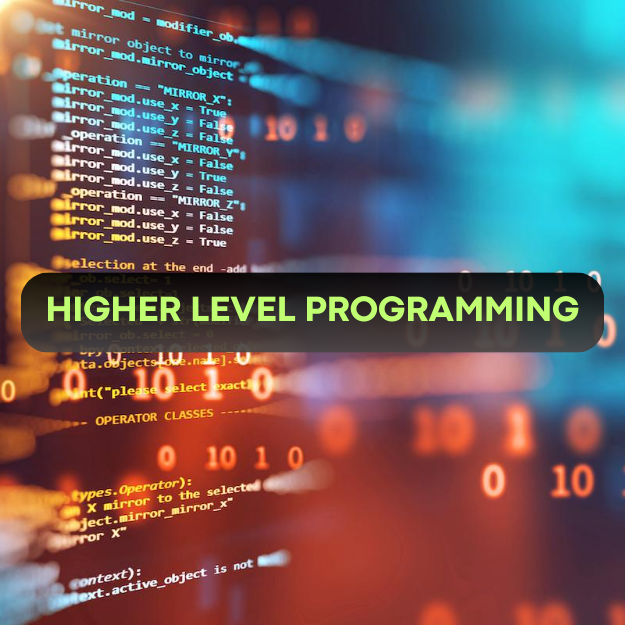

 

 

<h1 align="center">holbertonschool-higher_level_programming</h1>

 

- ### **[00 - Python - Hello, World](https://github.com/RazikaBengana/holbertonschool-higher_level_programming/tree/main/python-hello_world)**
- ### **[01 - Python - if/else, loops, functions](https://github.com/RazikaBengana/holbertonschool-higher_level_programming/tree/main/python-if_else_loops_functions)**
- ### **[02 - Python - import & modules](https://github.com/RazikaBengana/holbertonschool-higher_level_programming/tree/main/python-import_modules)**
- ### **[03 - Python - Data Structures: Lists, Tuples](https://github.com/RazikaBengana/holbertonschool-higher_level_programming/tree/main/python-data_structures)**
- ### **[04 - Python - More Data Structures: Set, Dictionary](https://github.com/RazikaBengana/holbertonschool-higher_level_programming/tree/main/python-more_data_structures)**
- ### **[05 - Python - Exceptions](https://github.com/RazikaBengana/holbertonschool-higher_level_programming/tree/main/python-exceptions)**
- ### **[06 - Python - Classes and Objects](https://github.com/RazikaBengana/holbertonschool-higher_level_programming/tree/main/python-classes)**
- ### **[07 - Python - Test-driven development](https://github.com/RazikaBengana/holbertonschool-higher_level_programming/tree/main/python-test_driven_development)**
- ### **[08 - Python - More Classes and Objects](https://github.com/RazikaBengana/holbertonschool-higher_level_programming/tree/main/python-more_classes)**
- ### **[09 - Python - Everything is object](https://github.com/RazikaBengana/holbertonschool-higher_level_programming/tree/main/python-everything_is_object)**
- ### **[10 - Python - Inheritance](https://github.com/RazikaBengana/holbertonschool-higher_level_programming/tree/main/python-inheritance)**
- ### **[11 - Python - Input/Output](https://github.com/RazikaBengana/holbertonschool-higher_level_programming/tree/main/python-input_output)**
- ### **[12 - Python - Almost a circle](https://github.com/RazikaBengana/holbertonschool-higher_level_programming/tree/main/python-almost_a_circle)**

 

---

 

- ### **[13 - SQL - Introduction](https://github.com/RazikaBengana/holbertonschool-higher_level_programming/tree/main/SQL_introduction)**
- ### **[14 - SQL - More queries](https://github.com/RazikaBengana/holbertonschool-higher_level_programming/tree/main/SQL_more_queries)**

 

---

 

- ### **[15 - Python - Object-relational mapping](https://github.com/RazikaBengana/holbertonschool-higher_level_programming/tree/main/python-object_relational_mapping)**

 

---

 

- ### **[16 - JavaScript - Warm up](https://github.com/RazikaBengana/holbertonschool-higher_level_programming/tree/main/javascript-warm_up)**
- ### **[17 - JavaScript - Objects, Scopes and Closures](https://github.com/RazikaBengana/holbertonschool-higher_level_programming/tree/main/javascript_objects_scopes_closures)**
- ### **[18 - JavaScript - Web scraping](https://github.com/RazikaBengana/holbertonschool-higher_level_programming/tree/main/javascript-web_scraping)**
- ### **[19 - JavaScript - Web jQuery](https://github.com/RazikaBengana/holbertonschool-higher_level_programming/tree/main/javascript-web_jquery)**