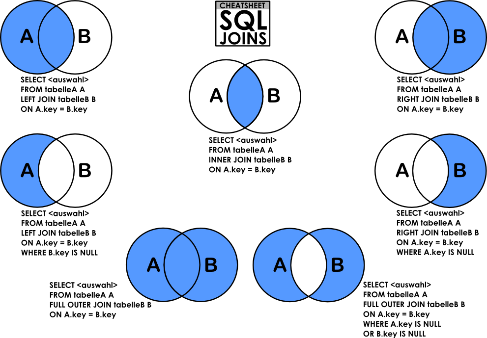

<div align="center">
<br>


</div>


<p align="center">


</p>


<h1 align="center"> SQL - More queries </h1>


<h3 align="center">
<a href="https://github.com/RazikaBengana/holbertonschool-higher_level_programming/tree/main/SQL_more_queries#eye-about">About</a> •
<a href="https://github.com/RazikaBengana/holbertonschool-higher_level_programming/tree/main/SQL_more_queries#hammer_and_wrench-tasks">Tasks</a> •
<a href="https://github.com/RazikaBengana/holbertonschool-higher_level_programming/tree/main/SQL_more_queries#memo-learning-objectives">Learning Objectives</a> •
<a href="https://github.com/RazikaBengana/holbertonschool-higher_level_programming/tree/main/SQL_more_queries#computer-requirements">Requirements</a> •
<a href="https://github.com/RazikaBengana/holbertonschool-higher_level_programming/tree/main/SQL_more_queries#keyboard-more-info">More Info</a> •
<a href="https://github.com/RazikaBengana/holbertonschool-higher_level_programming/tree/main/SQL_more_queries#mag_right-resources">Resources</a> •
<a href="https://github.com/RazikaBengana/holbertonschool-higher_level_programming/tree/main/SQL_more_queries#bust_in_silhouette-authors">Authors</a> •
<a href="https://github.com/RazikaBengana/holbertonschool-higher_level_programming/tree/main/SQL_more_queries#octocat-license">License</a>
</h3>

---

<!-- ------------------------------------------------------------------------------------------------- -->

<br>
<br>

## :eye: About

<br>

<div align="center">

**`SQL - more queries`** project delves into advanced SQL concepts and operations.
<br>
The programs cover complex database tasks such as creating and managing users with specific privileges, working with constraints (`NOT NULL`, `UNIQUE`, `PRIMARY KEY`, `FOREIGN KEY`), and performing advanced queries involving joins, subqueries, and data manipulation.
<br>
They progress from user management and table creation with constraints to sophisticated data retrieval operations, including multi-table joins, filtering, and sorting, providing a comprehensive exploration of more advanced SQL techniques.
<br>
<br>
This project has been created by **[Holberton School](https://www.holbertonschool.com/about-holberton)** to enable every student to understand how SQL language works.

</div>

<br>
<br>

<!-- ------------------------------------------------------------------------------------------------- -->

## :hammer_and_wrench: Tasks

<br>

**`0. My privileges!`**

**`1. Root user`**

**`2. Read user`**

**`3. Always a name`**

**`4. ID can't be null`**

**`5. Unique ID`**

**`6. States table`**

**`7. Cities table`**

**`8. Cities of California`**

**`9. Cities by States`**

**`10. Genre ID by show`**

**`11. Genre ID for all shows`**

**`12. No genre`**

**`13. Number of shows by genre`**

**`14. My genres`**

**`15. Only Comedy`**

**`16. List shows and genres`**

**`17. Not my genre`**

**`18. No Comedy tonight!`**

**`19. Rotten tomatoes`**

**`20. Best genre`**

**`21. How Do SQL Database Engines Work?`** 

<br>
<br>

<!-- ------------------------------------------------------------------------------------------------- -->

## :memo: Learning Objectives

<br>

**_You are expected to be able to [explain to anyone](https://fs.blog/feynman-learning-technique/), without the help of Google:_**

<br>

```diff

General

+ How to create a new MySQL user

+ How to manage privileges for a user to a database or table

+ What’s a PRIMARY KEY

+ What’s a FOREIGN KEY

+ How to use NOT NULL and UNIQUE constraints

+ How to retrieve datas from multiple tables in one request

+ What are subqueries

+ What are JOIN and UNION

```

<br>
<br>

<!-- ------------------------------------------------------------------------------------------------- -->

## :computer: Requirements

<br>

```diff

General

+ Allowed editors: vi, vim, emacs

+ All your files will be executed on Ubuntu 20.04 LTS using MySQL 8.0 (version 8.0.25)

+ All your files should end with a new line

+ All your SQL queries should have a comment just before (i.e. syntax above)

+ All your files should start by a comment describing the task

+ All SQL keywords should be in uppercase (SELECT, WHERE…)

+ A README.md file, at the root of the folder of the project, is mandatory

+ The length of your files will be tested using wc

```

<br>

**_Why all your files should end with a new line? See [HERE](https://unix.stackexchange.com/questions/18743/whats-the-point-in-adding-a-new-line-to-the-end-of-a-file/18789)_**

<br>
<br>

<!-- ------------------------------------------------------------------------------------------------- -->

## :keyboard: More Info

<br>

### Comments for your SQL file:

<br>

```sql
$ cat my_script.sql
-- 3 first students in the Batch ID=3
-- because Batch 3 is the best!
SELECT id, name FROM students WHERE batch_id = 3 ORDER BY created_at DESC LIMIT 3;
$
```

<br>
<br>

### Install MySQL 8.0 on Ubuntu 20.04 LTS:

<br>

:pushpin: **Note**:
<br>
<br>
If you’re using the provided sandbox you don’t need to install MySQL. <br>
Skip to the next section.

<br>

```yaml
$ sudo apt update
$ sudo apt install mysql-server
...
$ mysql --version
mysql  Ver 8.0.25-0ubuntu0.20.04.1 for Linux on x86_64 ((Ubuntu))
$
```

<br>
<br>

### Connect to your MySQL server:

<br>

```sql
$ sudo mysql
Welcome to the MySQL monitor.  Commands end with ; or \g.
Your MySQL connection id is 11
Server version: 8.0.25-0ubuntu0.20.04.1 (Ubuntu)

Copyright (c) 2000, 2021, Oracle and/or its affiliates.

Oracle is a registered trademark of Oracle Corporation and/or its
affiliates. Other names may be trademarks of their respective
owners.

Type 'help;' or '\h' for help. Type '\c' to clear the current input statement.

mysql>
mysql> quit
Bye
$
```

<br>
<br>

### Use the sandbox to run MySQL:

<br>

- In the container, credentials are `root/root`

  - Ask for container `Ubuntu 20.04`
  - Connect via SSH
  - OR connect via the Web terminal
  - In the container, you should start MySQL before playing with it:

<br>

```yaml
$ service mysql start                                                   
 * Starting MySQL database server mysqld 
$
$ cat 0-list_databases.sql | mysql -uroot -p                               
Database                                                                                   
information_schema                                                                         
mysql                                                                                      
performance_schema                                                                         
sys                      
$
```

<br>
<br>

### How to import a SQL dump:

<br>

```bash
$ echo "CREATE DATABASE hbtn_0d_tvshows;" | mysql -uroot -p
Enter password: 
$ curl "https://s3.eu-west-3.amazonaws.com/hbtn.intranet.project.files/holbertonschool-higher-level_programming+/274/hbtn_0d_tvshows.sql" -s | mysql -uroot -p hbtn_0d_tvshows
Enter password: 
$ echo "SELECT * FROM tv_genres" | mysql -uroot -p hbtn_0d_tvshows
Enter password: 
id  name
1   Drama
2   Mystery
3   Adventure
4   Fantasy
5   Comedy
6   Crime
7   Suspense
8   Thriller
$
```

<br>
<br>
<br>
<br>



<br>
<br>

<!-- ------------------------------------------------------------------------------------------------- -->

## :mag_right: Resources

<br>

**_Do you need some help?_**

<br>

**Read or watch:**

* [How To Create a New User and Grant Permissions in MySQL](https://www.digitalocean.com/community/tutorials/how-to-create-a-new-user-and-grant-permissions-in-mysql)

* [How To Use MySQL GRANT Statement To Grant Privileges To a User](https://www.mysqltutorial.org/mysql-administration/mysql-grant/)

* [MySQL constraints](https://zetcode.com/mysql/constraints/)

* [SQL technique: subqueries](https://web.csulb.edu/colleges/coe/cecs/dbdesign/dbdesign.php?page=sql/subqueries.php)

* [Basic query operation: the join](https://web.csulb.edu/colleges/coe/cecs/dbdesign/dbdesign.php?page=sql/join.php)

* [SQL technique: multiple joins and the distinct keyword](https://web.csulb.edu/colleges/coe/cecs/dbdesign/dbdesign.php?page=sql/multijoin.php)

* [SQL technique: join types](https://web.csulb.edu/colleges/coe/cecs/dbdesign/dbdesign.php?page=sql/jointypes.php)

* [SQL technique: union and minus](https://web.csulb.edu/colleges/coe/cecs/dbdesign/dbdesign.php?page=sql/setops.php)

* [MySQL Cheat Sheet](https://intellipaat.com/mediaFiles/2019/02/SQL-Commands-Cheat-Sheet.pdf?US)

* [The Seven Types of SQL Joins](https://tableplus.com/blog/2018/09/a-beginners-guide-to-seven-types-of-sql-joins.html)

* [MySQL Tutorial](https://www.youtube.com/watch?v=yPu6qV5byu4)

* [SQL Style Guide](https://www.sqlstyle.guide/)

* [MySQL 8.0 SQL Statement Syntax](https://dev.mysql.com/doc/refman/8.0/en/sql-statements.html)

<br>
<br>

**Extra resources around relational database model design:**

<br>

* [Design](https://www.guru99.com/database-design.html)

* [Normalization](https://www.guru99.com/database-normalization.html)

* [ER Modeling](https://www.guru99.com/er-modeling.html)

<br>
<br>

<!-- ------------------------------------------------------------------------------------------------- -->

## :bust_in_silhouette: Authors

<br>


<br>
<br>

<!-- ------------------------------------------------------------------------------------------------- -->

## :octocat: License

<br>

```SQL - more queries``` _project has no license specified._

<br>
<br>

---

<p align="center"><br>2022</p>