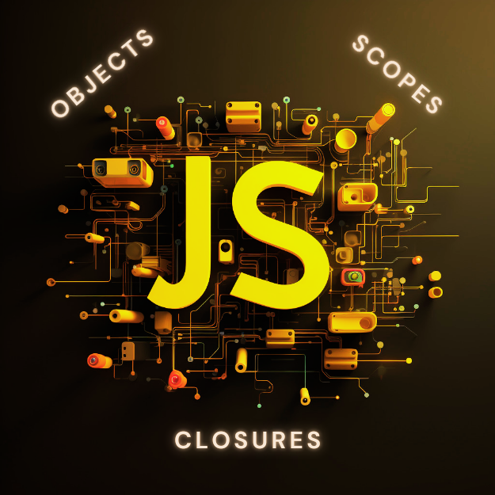

<div align="center">
<br>




</div>


<p align="center">


</p>


<h1 align="center"> JavaScript - Objects, Scopes and Closures </h1>


<h3 align="center">
<a href="https://github.com/RazikaBengana/holbertonschool-higher_level_programming/tree/main/javascript_objects_scopes_closures#eye-about">About</a> •
<a href="https://github.com/RazikaBengana/holbertonschool-higher_level_programming/tree/main/javascript_objects_scopes_closures#hammer_and_wrench-tasks">Tasks</a> •
<a href="https://github.com/RazikaBengana/holbertonschool-higher_level_programming/tree/main/javascript_objects_scopes_closures#memo-learning-objectives">Learning Objectives</a> •
<a href="https://github.com/RazikaBengana/holbertonschool-higher_level_programming/tree/main/javascript_objects_scopes_closures#computer-requirements">Requirements</a> •
<a href="https://github.com/RazikaBengana/holbertonschool-higher_level_programming/tree/main/javascript_objects_scopes_closures#keyboard-more-info">More Info</a> •
<a href="https://github.com/RazikaBengana/holbertonschool-higher_level_programming/tree/main/javascript_objects_scopes_closures#mag_right-resources">Resources</a> •
<a href="https://github.com/RazikaBengana/holbertonschool-higher_level_programming/tree/main/javascript_objects_scopes_closures#bust_in_silhouette-authors">Authors</a> •
<a href="https://github.com/RazikaBengana/holbertonschool-higher_level_programming/tree/main/javascript_objects_scopes_closures#octocat-license">License</a>
</h3>

---

<!-- ------------------------------------------------------------------------------------------------- -->

<br>
<br>

## :eye: About

<br>

<div align="center">

**`JavaScript - objects, scopes and closures`** project contains various exercises that demonstrate the implementation of object-oriented concepts in JavaScript, with a focus on scopes and closures.
<br>
The programs include examples like rectangle manipulation, reversing arrays, tracking occurrences, and converting numbers, showcasing practical use of these JavaScript principles.
<br>
<br>
This project has been created by **[Holberton School](https://www.holbertonschool.com/about-holberton)** to enable every student to understand how Javascript language works.

</div>

<br>
<br>

<!-- ------------------------------------------------------------------------------------------------- -->

## :hammer_and_wrench: Tasks

<br>

**`0. Rectangle #0`**

**`1. Rectangle #1`**

**`2. Rectangle #2`**

**`3. Rectangle #3`**

**`4. Rectangle #4`**

**`5. Square #0`**

**`6. Square #1`**

**`7. Occurrences`**

**`8. Esrever`**

**`9. Log me`**

**`10. Number conversion`**

**`11. Factor index`**

**`12. Sorted occurences`**

**`13. Concat files`**

<br>
<br>

<!-- ------------------------------------------------------------------------------------------------- -->

## :memo: Learning objectives

<br>

**_You are expected to be able to [explain to anyone](https://fs.blog/feynman-learning-technique/), without the help of Google:_**

<br>

```diff

General

+ Why JavaScript programming is amazing

+ How to create an object in JavaScript

+ What this means

+ What undefined means

+ Why the variable type and scope is important

+ What is a closure

+ What is a prototype

+ How to inherit an object from another

```

<br>
<br>

<!-- ------------------------------------------------------------------------------------------------- -->

## :computer: Requirements

<br>

```diff

General

+ Allowed editors: vi, vim, emacs

+ All your files will be interpreted on Ubuntu 20.04 LTS using node (version 14.x)

+ All your files should end with a new line

+ The first line of all your files should be exactly #!/usr/bin/node

+ A README.md file, at the root of the folder of the project, is mandatory

+ Your code should be semistandard compliant. Rules of Standard + semicolons on top. Also as reference: AirBnB style

+ All your files must be executable

+ The length of your files will be tested using wc

- You are not allowed to use var

```

<br>

- [Rules of Standard](https://standardjs.com/rules.html) + [semicolons on top](https://github.com/standard/semistandard)

- [AirBnB style](https://github.com/airbnb/javascript)

<br>

**_Why all your files should end with a new line? See [HERE](https://unix.stackexchange.com/questions/18743/whats-the-point-in-adding-a-new-line-to-the-end-of-a-file/18789)_**

<br>
<br>

<!-- ------------------------------------------------------------------------------------------------- -->

## :keyboard: More Info

<br>

### Install `Node 14`:

<br>

```yaml
$ curl -sL https://deb.nodesource.com/setup_14.x | sudo -E bash -
$ sudo apt-get install -y nodejs
```

<br>
<br>

### Install `semi-standard`:

<br>

- [Documentation](https://github.com/standard/semistandard)

<br>

```yaml
$ sudo npm install semistandard --global
```

<br>
<br>

<!-- ------------------------------------------------------------------------------------------------- -->

## :mag_right: Resources

<br>

**_Do you need some help?_**

<br>

**Read or watch:**

* [JavaScript object basics](https://developer.mozilla.org/en-US/docs/Learn/JavaScript/Objects/Basics)

* [Object-oriented JavaScript](https://developer.mozilla.org/en-US/docs/Learn/JavaScript/Objects/Classes_in_JavaScript)

* [Class - ES6](https://developer.mozilla.org/en-US/docs/Web/JavaScript/Reference/Classes)

* [super - ES6](https://developer.mozilla.org/en-US/docs/Web/JavaScript/Reference/Operators/super)

* [extends - ES6](https://developer.mozilla.org/en-US/docs/Web/JavaScript/Reference/Classes/extends)

* [Object prototypes](https://developer.mozilla.org/en-US/docs/Learn/JavaScript/Objects/Object_prototypes)

* [Inheritance in JavaScript](https://developer.mozilla.org/en-US/docs/Learn/JavaScript/Objects/Classes_in_JavaScript)

* [Closures](https://developer.mozilla.org/en-US/docs/Web/JavaScript/Closures)

* [this/self](https://alistapart.com/article/getoutbindingsituations/)

* [Modern JS](https://github.com/mbeaudru/modern-js-cheatsheet)

<br>
<br>

<!-- ------------------------------------------------------------------------------------------------- -->

## :bust_in_silhouette: Authors

<br>

**${\color{blue}Razika \space Bengana}$**

<br>
<br>

<!-- ------------------------------------------------------------------------------------------------- -->

## :octocat: License

<br>

```JavaScript - objects, scopes and closures``` _project has no license specified._

<br>
<br>

---

<p align="center"><br>2022</p>