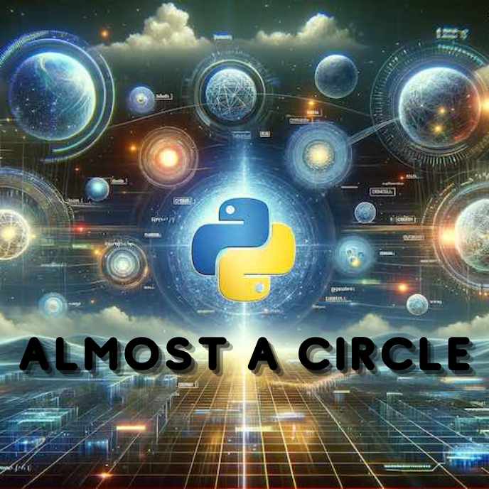

<div align="center">
<br>



</div>


<p align="center">


</p>


<h1 align="center"> Python - Almost a circle </h1>


<h3 align="center">
<a href="https://github.com/RazikaBengana/holbertonschool-higher_level_programming/tree/main/python-almost_a_circle#eye-about">About</a> •
<a href="https://github.com/RazikaBengana/holbertonschool-higher_level_programming/tree/main/python-almost_a_circle#hammer_and_wrench-tasks">Tasks</a> •
<a href="https://github.com/RazikaBengana/holbertonschool-higher_level_programming/tree/main/python-almost_a_circle#memo-learning-objectives">Learning Objectives</a> •
<a href="https://github.com/RazikaBengana/holbertonschool-higher_level_programming/tree/main/python-almost_a_circle#computer-requirements">Requirements</a> •
<a href="https://github.com/RazikaBengana/holbertonschool-higher_level_programming/tree/main/python-almost_a_circle#mag_right-resources">Resources</a> •
<a href="https://github.com/RazikaBengana/holbertonschool-higher_level_programming/tree/main/python-almost_a_circle#bust_in_silhouette-authors">Authors</a> •
<a href="https://github.com/RazikaBengana/holbertonschool-higher_level_programming/tree/main/python-almost_a_circle#octocat-license">License</a>
</h3>

---

<!-- ------------------------------------------------------------------------------------------------- -->

<br>
<br>

## :eye: About

<br>

<div align="center">

**`Python - almost a circle`** theme focuses on advanced object-oriented programming concepts, including class inheritance, JSON serialization, and unit testing.
<br>
The programs implement a `Base` class and its subclasses `Rectangle` and `Square`, demonstrating principles such as encapsulation, polymorphism, and file I/O, while also incorporating comprehensive unit tests to ensure code functionality and reliability.
<br>
<br>
This project has been created by **[Holberton School](https://www.holbertonschool.com/about-holberton)** to enable every student to understand how Python language works.

</div>

<br>
<br>

### Background Context

<br>

#### In this project, you will review everything about Python:

<br>

- Import
- Exceptions
- Class
- Private attribute
- Getter/Setter
- Class method
- Static method
- Inheritance
- Unittest
- Read/Write file

<br>

#### You will also learn about:

<br>

- `args` and `kwargs`
- Serialization/Deserialization
- JSON

<br>
<br>

#### Step by step:

<br>

| Step | Description                                                                                                                                                                                                     |
|------|-----------------------------------------------------------------------------------------------------------------------------------------------------------------------------------------------------------------|
| 1 | <br> Write the first class `Base` <br> <br>                                                                                                                                                                     |
| 2 | <br> Write the class `Rectangle` that inherits from `Base` <br> <br>                                                                                                                                            |
| 3 | <br> Update the class `Rectangle` by adding validation of all setter methods and instantiation (`id` excluded) <br> <br>                                                                                        |
| 4 | <br> Update the class `Rectangle` by adding the public method `def area(self):` that returns the area value of the `Rectangle` instance <br> <br>                                                               |
| 5 | <br> Update the class `Rectangle` by adding the public method `def display(self):` that prints in stdout the `Rectangle` instance with the character `#` (you don’t need to handle `x` and `y` here) <br> <br>  |
| 6 | <br> Update the class `Rectangle` by overriding the `str` method so that it returns `[Rectangle]` instance <br> <br>                                                                                            |
| 7 | <br> Update the class `Rectangle` by improving the public method `def display(self):` to print in stdout the `Rectangle` instance with the character `#` by taking care of `x` and `y` <br> <br>                |
| 8 | <br> Update the class `Rectangle` by adding the public method `def update(self, *args):` that assigns an argument to each attribute <br> <br>                                                                   |
| 9 | <br> Update the class `Rectangle` by updating the public method `def update(self, *args):` by changing the prototype to `update(self, *args, kwargs)` that assigns a key/value argument to attributes <br> <br> |
| 10 | <br> Write the class `Square` that inherits from `Rectangle` <br> <br>                                                                                                                                          |
| 11 | <br> Update the class `Square` by adding the public getter and setter `size` <br> <br>                                                                                                                          |
| 12 | <br> Update the class `Square` by adding the public method `def update(self, *args, kwargs)` that assigns attributes <br> <br>                                                                                  |
| 13 | <br> Update the class `Rectangle` by adding the public method `def to_dictionary(self):` that returns the dictionary representation of a `Rectangle` <br> <br>                                                  |
| 14 | <br> Update the class `Square` by adding the public method `def to_dictionary(self):` that returns the dictionary representation of a `Square` <br> <br>                                                        |
| 15 | <br> Update the class `Base` by adding the class method `def savetofile(cls, listobjs):` that writes the JSON string representation of `listobjs` to a file <br> <br>                                           |
| 16 | <br> Update the class `Base` by adding the static method `def fromjsonstring(jsonstring):` that returns the list of the JSON string representation `jsonstring` <br> <br>                                       |
| 17 | <br> Update the class `Base` by adding the class method `def create(cls, dictionary):` that returns an instance with all attributes already set <br> <br>                                                       |
| 18 | <br> Update the class `Base` by adding the class method `def loadfromfile(cls):` that returns a list of instances <br> <br>                                                                                     |

<br>
<br>

<!-- ------------------------------------------------------------------------------------------------- -->

## :hammer_and_wrench: Tasks

<br>

**`0. If it's not tested it doesn't work`**

**`1. Base class`**

**`2. First Rectangle`**

**`3. Validate attributes`**

**`4. Area first`**

**`5. Display #0`**

**`6. __str__`**

**`7. Display #1`**

**`8. Update #0`**

**`9. Update #1`**

**`10. And now, the Square!`**

**`11. Square size`**

**`12. Square update`**

**`13. Rectangle instance to dictionary representation`**

**`14. Square instance to dictionary representation`**

**`15. Dictionary to JSON string`**

**`16. JSON string to file`**

**`17. JSON string to dictionary`**

**`18. Dictionary to Instance`**

**`19. File to instances`**

**`20. Let's draw it`**

<br>
<br>

<!-- ------------------------------------------------------------------------------------------------- -->

## :memo: Learning Objectives

<br>

**_You are expected to be able to [explain to anyone](https://fs.blog/feynman-learning-technique/), without the help of Google:_**

<br>

```diff

General

+ What is Unit testing and how to implement it in a large project

+ How to serialize and deserialize a Class

+ How to write and read a JSON file

+ What is *args and how to use it

+ What is **kwargs and how to use it

+ How to handle named arguments in a function

```

<br>
<br>

<!-- ------------------------------------------------------------------------------------------------- -->

## :computer: Requirements

<br>

```diff

Python Scripts

+ Allowed editors: vi, vim, emacs

+ All your files will be interpreted/compiled on Ubuntu 20.04 LTS using python3 (version 3.8.5)

+ All your files should end with a new line

+ The first line of all your files should be exactly #!/usr/bin/python3

+ A README.md file, at the root of the folder of the project, is mandatory

+ Your code should use the pycodestyle (version 2.7.*)

+ All your files must be executable

+ The length of your files will be tested using wc

+ All your modules should be documented: python3 -c 'print(__import__("my_module").__doc__)'

+ All your classes should be documented: python3 -c 'print(__import__("my_module").MyClass.__doc__)'

+ All your functions (inside and outside a class) should be documented: python3 -c 'print(__import__("my_module").my_function.__doc__)' and python3 -c 'print(__import__("my_module").MyClass.my_function.__doc__)'

+ A documentation is not a simple word, it’s a real sentence explaining what’s the purpose of the module, class or method (the length of it will be verified)


Python Unit Tests

+ Allowed editors: vi, vim, emacs

+ All your files should end with a new line

+ All your test files should be inside a folder tests

+ You have to use the unittest module

+ All your test files should be python files (extension: .py)

+ All your test files and folders should start with test_

+ Your file organization in the tests folder should be the same as your project: ex: for models/base.py, unit tests must be in: tests/test_models/test_base.py

+ All your tests should be executed by using this command: python3 -m unittest discover tests

+ You can also test file by file by using this command: python3 -m unittest tests/test_models/test_base.py

+ We strongly encourage you to work together on test cases so that you don’t miss any edge case

```

<br>

**_Why all your files should end with a new line? See [HERE](https://unix.stackexchange.com/questions/18743/whats-the-point-in-adding-a-new-line-to-the-end-of-a-file/18789)_**

<br>
<br>

<!-- ------------------------------------------------------------------------------------------------- -->

## :mag_right: Resources

<br>

**_Do you need some help?_**

<br>

**Read or watch:**

* [args/kwargs](https://yasoob.me/2013/08/04/args-and-kwargs-in-python-explained/)

* [JSON encoder and decoder](https://docs.python.org/3/library/json.html)

* [unittest module](https://docs.python.org/3.4/library/unittest.html#module-unittest)

* [Python test cheatsheet](https://www.pythonsheets.com/notes/python-tests.html)

<br>
<br>

<!-- ------------------------------------------------------------------------------------------------- -->

## :bust_in_silhouette: Authors

<br>


<br>
<br>

<!-- ------------------------------------------------------------------------------------------------- -->

## :octocat: License

<br>

```Python - almost a circle``` _project has no license specified._

<br>
<br>

---

<p align="center"><br>2022</p>