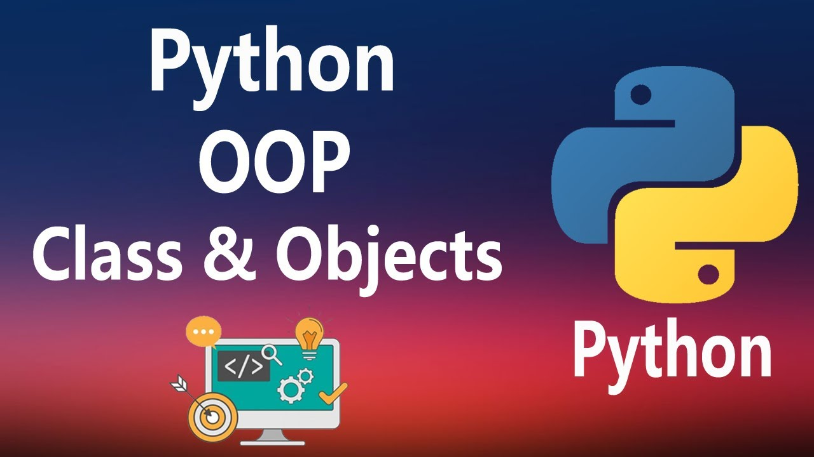

<div align="center">
<br>



</div>


<p align="center">


</p>


<h1 align="center"> Python - Classes and Objects </h1>


<h3 align="center">
<a href="https://github.com/RazikaBengana/holbertonschool-higher_level_programming/tree/main/python-classes#eye-about">About</a> •
<a href="https://github.com/RazikaBengana/holbertonschool-higher_level_programming/tree/main/python-classes#hammer_and_wrench-tasks">Tasks</a> •
<a href="https://github.com/RazikaBengana/holbertonschool-higher_level_programming/tree/main/python-classes#memo-learning-objectives">Learning Objectives</a> •
<a href="https://github.com/RazikaBengana/holbertonschool-higher_level_programming/tree/main/python-classes#computer-requirements">Requirements</a> •
<a href="https://github.com/RazikaBengana/holbertonschool-higher_level_programming/tree/main/python-classes#keyboard-more-info">More Info</a> •
<a href="https://github.com/RazikaBengana/holbertonschool-higher_level_programming/tree/main/python-classes#mag_right-resources">Resources</a> •
<a href="https://github.com/RazikaBengana/holbertonschool-higher_level_programming/tree/main/python-classes#bust_in_silhouette-authors">Authors</a> •
<a href="https://github.com/RazikaBengana/holbertonschool-higher_level_programming/tree/main/python-classes#octocat-license">License</a>
</h3>

---

<!-- ------------------------------------------------------------------------------------------------- -->

<br>
<br>

## :eye: About

<br>

<div align="center">

**`Python - classes and objects`** theme introduces the fundamental concepts of object-oriented programming in Python.
<br>
The programs demonstrate the creation and use of classes, covering topics such as class definition, instance attributes, methods, properties, and even a basic implementation of a singly linked list, progressively building complexity to showcase various aspects of Python's `OOP` capabilities.
<br>
<br>
This project has been created by **[Holberton School](https://www.holbertonschool.com/about-holberton)** to enable every student to understand how Python language works.

</div>

<br>
<br>

### Background Context

<br>

It’s VERY important that you read at least all the material that is listed below (and skip what we recommend you to skip, you will see them later in the curriculum).

As usual, make sure you type (never copy and paste), test, understand all examples shown in the following links (including those in the video), test again etc. 

The biggest and most important takeaway of this project is: experiment by yourself `OOP`, play with it!

Read or watch the below resources in the order presented.

<br>
<br>

<!-- ------------------------------------------------------------------------------------------------- -->

## :hammer_and_wrench: Tasks

<br>

**`0. My first square`**

**`1. Square with size`**

**`2. Size validation`**

**`3. Area of a square`**

**`4. Access and update private attribute`**

**`5. Printing a square`**

**`6. Coordinates of a square`**

**`7. Singly linked list`**

**`8. Print Square instance`**

**`9. Compare 2 squares`**

<br>
<br>

<!-- ------------------------------------------------------------------------------------------------- -->

## :memo: Learning Objectives

<br>

**_You are expected to be able to [explain to anyone](https://fs.blog/feynman-learning-technique/), without the help of Google:_**

<br>

```diff

General

+ What is OOP

+ “first-class everything”

+ What is a class

+ What is an object and an instance

+ What is the difference between a class and an object or instance

+ What is an attribute

+ What are and how to use public, protected and private attributes

+ What is self

+ What is a method

+ What is the special __init__ method and how to use it

+ What is Data Abstraction, Data Encapsulation, and Information Hiding

+ What is a property

+ What is the difference between an attribute and a property in Python

+ What is the Pythonic way to write getters and setters in Python

+ How to dynamically create arbitrary new attributes for existing instances of a class

+ How to bind attributes to object and classes

+ What is the __dict__ of a class and/or instance of a class and what does it contain

+ How does Python find the attributes of an object or class

+ How to use the getattr function

```

<br>
<br>

<!-- ------------------------------------------------------------------------------------------------- -->

## :computer: Requirements

<br>

```diff

General

+ Allowed editors: vi, vim, emacs

+ All your files will be interpreted/compiled on Ubuntu 20.04 LTS using python3 (version 3.8.5)

+ All your files should end with a new line

+ The first line of all your files should be exactly #!/usr/bin/python3

+ A README.md file, at the root of the folder of the project, is mandatory

+ Your code should use the pycodestyle (version 2.7.*)

+ All your files must be executable

+ The length of your files will be tested using wc

+ All your modules should have a documentation (python3 -c 'print(__import__("my_module").__doc__)')

+ All your classes should have a documentation (python3 -c 'print(__import__("my_module").MyClass.__doc__)')

+ All your functions (inside and outside a class) should have a documentation (python3 -c 'print(__import__("my_module").my_function.__doc__)' and python3 -c 'print(__import__("my_module").MyClass.my_function.__doc__)')

+ A documentation is not a simple word, it’s a real sentence explaining what’s the purpose of the module, class or method (the length of it will be verified)

```

<br>

**_Why all your files should end with a new line? See [HERE](https://unix.stackexchange.com/questions/18743/whats-the-point-in-adding-a-new-line-to-the-end-of-a-file/18789)_**

<br>
<br>

<!-- ------------------------------------------------------------------------------------------------- -->

## :keyboard: More Info

<br>

- :warning: **Documentation is now mandatory!** Each module, class, and method must contain docstring as comments.

  - [Example Google Style Python Docstrings](https://sphinxcontrib-napoleon.readthedocs.io/en/latest/example_google.html)

<br>
<br>

<!-- ------------------------------------------------------------------------------------------------- -->

## :mag_right: Resources

<br>

**_Do you need some help?_**

<br>

**Read or watch:**

* [Object Oriented Programming (1)](https://python.swaroopch.com/oop.html)

* [Object Oriented Programming (2)](https://python-course.eu/oop/object-oriented-programming.php)

* [Properties vs. Getters and Setters](https://python-course.eu/oop/properties-vs-getters-and-setters.php)

* [Learn to Program 9 : Object Oriented Programming](https://www.youtube.com/watch?v=1AGyBuVCTeE&)

* [Python Classes and Objects](https://www.youtube.com/watch?v=apACNr7DC_s)

* [Object Oriented Programming (3)](https://www.youtube.com/watch?v=-DP1i2ZU9gk)

<br>
<br>

<!-- ------------------------------------------------------------------------------------------------- -->

## :bust_in_silhouette: Authors

<br>


<br>
<br>

<!-- ------------------------------------------------------------------------------------------------- -->

## :octocat: License

<br>

```Python - classes and objects``` _project has no license specified._

<br>
<br>

---

<p align="center"><br>2022</p>