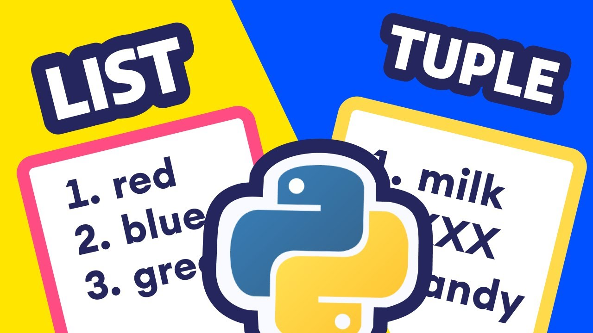

<div align="center">
<br>



</div>


<p align="center">


</p>


<h1 align="center"> Python - Data Structures: Lists, Tuples </h1>


<h3 align="center">
<a href="https://github.com/RazikaBengana/holbertonschool-higher_level_programming/tree/main/python-data_structures#eye-about">About</a> •
<a href="https://github.com/RazikaBengana/holbertonschool-higher_level_programming/tree/main/python-data_structures#hammer_and_wrench-tasks">Tasks</a> •
<a href="https://github.com/RazikaBengana/holbertonschool-higher_level_programming/tree/main/python-data_structures#memo-learning-objectives">Learning Objectives</a> •
<a href="https://github.com/RazikaBengana/holbertonschool-higher_level_programming/tree/main/python-data_structures#computer-requirements">Requirements</a> •
<a href="https://github.com/RazikaBengana/holbertonschool-higher_level_programming/tree/main/python-data_structures#mag_right-resources">Resources</a> •
<a href="https://github.com/RazikaBengana/holbertonschool-higher_level_programming/tree/main/python-data_structures#bust_in_silhouette-authors">Authors</a> •
<a href="https://github.com/RazikaBengana/holbertonschool-higher_level_programming/tree/main/python-data_structures#octocat-license">License</a>
</h3>

---

<!-- ------------------------------------------------------------------------------------------------- -->

<br>
<br>

## :eye: About

<br>

<div align="center">

**`Python - data structures: lists, tuples`** theme introduces fundamental data structures in Python.
<br>
The programs cover operations on `lists` and `tuples`, including printing, accessing, modifying elements, reversing lists, removing characters from strings, working with matrices, and performing basic computations with these data structures.
<br>
<br>
This project has been created by **[Holberton School](https://www.holbertonschool.com/about-holberton)** to enable every student to understand how Python language works.

</div>

<br>
<br>

<!-- ------------------------------------------------------------------------------------------------- -->

## :hammer_and_wrench: Tasks

<br>

**`0. Print a list of integers`**

**`1. Secure access to an element in a list`**

**`2. Replace element`**

**`3. Print a list of integers... in reverse!`**

**`4. Replace in a copy`**

**`5. Can you C me now?`**

**`6. Lists of lists = Matrix`**

**`7. Tuples addition`**

**`8. More returns!`**

**`9. Find the max`**

**`10. Only by 2`**

**`11. Delete at`**

**`12. Switch`**

<br>
<br>

<!-- ------------------------------------------------------------------------------------------------- -->

## :memo: Learning objectives

<br>

**_You are expected to be able to [explain to anyone](https://fs.blog/feynman-learning-technique/), without the help of Google:_**

<br>

```diff

General

+ What are lists and how to use them

+ What are the differences and similarities between strings and lists

+ What are the most common methods of lists and how to use them

+ How to use lists as stacks and queues

+ What are list comprehensions and how to use them

+ What are tuples and how to use them

+ When to use tuples versus lists

+ What is a sequence

+ What is tuple packing

+ What is sequence unpacking

+ What is the del statement and how to use it

```

<br>
<br>

<!-- ------------------------------------------------------------------------------------------------- -->

## :computer: Requirements

<br>

```diff

Python Scripts

+ Allowed editors: vi, vim, emacs

+ All your files will be interpreted/compiled on Ubuntu 20.04 LTS using python3 (version 3.8.5)

+ All your files should end with a new line

+ The first line of all your files should be exactly #!/usr/bin/python3

+ A README.md file, at the root of the folder of the project, is mandatory

+ Your code should use the pycodestyle (version 2.7.*)

+ All your files must be executable

+ The length of your files will be tested using wc

```

<br>

**_Why all your files should end with a new line? See [HERE](https://unix.stackexchange.com/questions/18743/whats-the-point-in-adding-a-new-line-to-the-end-of-a-file/18789)_**

<br>
<br>

<!-- ------------------------------------------------------------------------------------------------- -->

## :mag_right: Resources

<br>

**_Do you need some help?_**

<br>

**Read or watch:**

* [3.1.3. Lists](https://docs.python.org/3/tutorial/introduction.html#lists)

* [Data structures](https://docs.python.org/3/tutorial/datastructures.html)

* [Learn to Program 6 : Lists](https://www.youtube.com/watch?v=A1HUzrvS-Pw)

<br>
<br>

<!-- ------------------------------------------------------------------------------------------------- -->

## :bust_in_silhouette: Authors

<br>

**${\color{blue}Razika \space Bengana}$**

<br>
<br>

<!-- ------------------------------------------------------------------------------------------------- -->

## :octocat: License

<br>

```Python - data structures: lists, tuples``` _project has no license specified._

<br>
<br>

---

<p align="center"><br>2022</p>