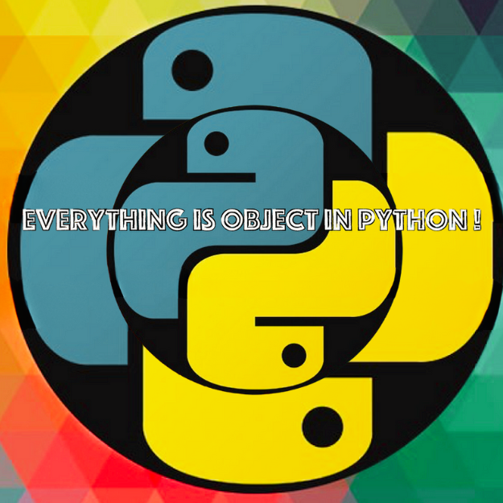

<div align="center">
<br>



</div>


<p align="center">


</p>


<h1 align="center"> Python - Everything is object </h1>


<h3 align="center">
<a href="https://github.com/RazikaBengana/holbertonschool-higher_level_programming/tree/main/python-everything_is_object#eye-about">About</a> •
<a href="https://github.com/RazikaBengana/holbertonschool-higher_level_programming/tree/main/python-everything_is_object#hammer_and_wrench-tasks">Tasks</a> •
<a href="https://github.com/RazikaBengana/holbertonschool-higher_level_programming/tree/main/python-everything_is_object#memo-learning-objectives">Learning Objectives</a> •
<a href="https://github.com/RazikaBengana/holbertonschool-higher_level_programming/tree/main/python-everything_is_object#computer-requirements">Requirements</a> •
<a href="https://github.com/RazikaBengana/holbertonschool-higher_level_programming/tree/main/python-everything_is_object#mag_right-resources">Resources</a> •
<a href="https://github.com/RazikaBengana/holbertonschool-higher_level_programming/tree/main/python-everything_is_object#bust_in_silhouette-authors">Authors</a> •
<a href="https://github.com/RazikaBengana/holbertonschool-higher_level_programming/tree/main/python-everything_is_object#octocat-license">License</a>
</h3>

---

<!-- ------------------------------------------------------------------------------------------------- -->

<br>
<br>

## :eye: About

<br>

<div align="center">

**`Python - everything is object`** theme explores the fundamental concept that all data in Python is represented as objects, delving into object identity, mutability, and reference counting.
<br>
The programs primarily consist of text files containing answers to conceptual questions about object behavior, complemented by a few Python scripts that demonstrate practical applications such as string manipulation, class attribute restrictions, and shallow copying of lists.
<br>
<br>
This project has been created by **[Holberton School](https://www.holbertonschool.com/about-holberton)** to enable every student to understand how Python language works.

</div>

<br>
<br>

### Background Context

<br>

Now that we understand that everything is an object and have a little bit of knowledge, let’s pause and look a little bit closer at how Python works with different types of objects.

<br>

- BTW, have you ever modified a variable without knowing it or wanting to? I mean:

<br>

```yaml
>>> a = 1
>>> b = a
>>> a = 2
>>> b
1
>>> 
```

<br>
<br>

- OK. But what about this?

<br>

```yaml
>>> l = [1, 2, 3]
>>> m = l
>>> l[0] = 'x'
>>> m
['x', 2, 3]
>>> 
```

<br>
<br>

This project is a little bit different than the usual projects. <br>
The first part is only questions about Python’s specificity like “What would be the result of…”. <br>
You should read all documentation first (as usual :)), then take the time to think and brainstorm about what you think and why. <br>
Try to do this without coding anything for a few hours.

Trying examples in the Python interpreter will give you most of the answers without having to think about it. <br>
Don’t go this route. <br>
First read, then think, then brainstorm. <br>
Only then you can test in the interpreter.

It’s important that you truly understand the reasons behind the answers of all those tasks so that you can apply the same logic to other variables and other variable types.

Note that during interviews for Python positions, you will most likely have to answer to these type of questions.

All your answers should be only one line in a file. <br>
No space before or after the answer.

<br>
<br>

<!-- ------------------------------------------------------------------------------------------------- -->

## :hammer_and_wrench: Tasks

<br>

**`0. Who am I?`**

**`1. Where are you?`**

**`2. Right count`**

**`3. Right count =`**

**`4. Right count =`**

**`5. Right count =+`**

**`6. Is equal`**

**`7. Is the same`**

**`8. Is really equal`**

**`9. Is really the same`**

**`10. And with a list, is it equal`**

**`11. And with a list, is it the same`**

**`12. And with a list, is it really equal`**

**`13. And with a list, is it really the same`**

**`14. List append`**

**`15. List add`**

**`16. Integer incrementation`**

**`17. List incrementation`**

**`18. List assignation`**

**`19. Copy a list object`**

**`20. Tuple or not?`**

**`21. Tuple or not?`**

**`22. Tuple or not?`**

**`23. Tuple or not?`**

**`24. Who I am?`**

**`25. Tuple or not`**

**`26. Empty is not empty`**

**`27. Still the same?`**

**`28. Same or not?`**

**`29. Python3: Mutable, Immutable... everything is object!`** (blogspot)

**`30. #pythonic`**

**`31. Low memory cost`**

**`32. int 1/3`**

**`33. int 2/3`**

**`34. int 3/3`**

**`35. Clear strings`**

<br>
<br>

<!-- ------------------------------------------------------------------------------------------------- -->

## :memo: Learning Objectives

<br>

**_You are expected to be able to [explain to anyone](https://fs.blog/feynman-learning-technique/), without the help of Google:_**

<br>

```diff

General

+ What is an object

+ What is the difference between a class and an object or instance

+ What is the difference between immutable object and mutable object

+ What is a reference

+ What is an assignment

+ What is an alias

+ How to know if two variables are identical

+ How to know if two variables are linked to the same object

+ How to display the variable identifier (which is the memory address in the CPython implementation)

+ What is mutable and immutable

+ What are the built-in mutable types

+ What are the built-in immutable types

+ How does Python pass variables to functions

```

<br>
<br>

<!-- ------------------------------------------------------------------------------------------------- -->

## :computer: Requirements

<br>

```diff

Python Scripts

+ Allowed editors: vi, vim, emacs

+ All your files will be interpreted/compiled on Ubuntu 20.04 LTS using python3 (version 3.8.5)

+ All your files should end with a new line

+ The first line of all your files should be exactly #!/usr/bin/python3

+ A README.md file, at the root of the folder of the project, is mandatory

+ Your code should use the pycodestyle (version 2.7.*)

+ All your files must be executable

+ The length of your files will be tested using wc


.txt Answer Files

+ Only one line

- No Shebang on the first line (i.e. “#!/usr/bin/python3”)

+ All your files should end with a new line

```

<br>

**_Why all your files should end with a new line? See [HERE](https://unix.stackexchange.com/questions/18743/whats-the-point-in-adding-a-new-line-to-the-end-of-a-file/18789)_**

<br>
<br>

<!-- ------------------------------------------------------------------------------------------------- -->

## :mag_right: Resources

<br>

**_Do you need some help?_**

<br>

**Read or watch:**

* [9.10. Objects and values](https://www.openbookproject.net/thinkcs/python/english2e/ch09.html#objects-and-values)

* [9.11. Aliasing](https://www.openbookproject.net/thinkcs/python/english2e/ch09.html#aliasing)

* [Immutable vs mutable types](https://stackoverflow.com/questions/8056130/immutable-vs-mutable-types)

* [Mutation](https://www.composingprograms.com/pages/24-mutable-data.html#sequence-objects)

* [9.12. Cloning lists](https://www.openbookproject.net/thinkcs/python/english2e/ch09.html#cloning-lists)

* [Python tuples: immutable but potentially changing](http://radar.oreilly.com/2014/10/python-tuples-immutable-but-potentially-changing.html)

<br>
<br>

<!-- ------------------------------------------------------------------------------------------------- -->

## :bust_in_silhouette: Authors

<br>


<br>
<br>

<!-- ------------------------------------------------------------------------------------------------- -->

## :octocat: License

<br>

```Python - everything is object``` _project has no license specified._

<br>
<br>

---

<p align="center"><br>2022</p>