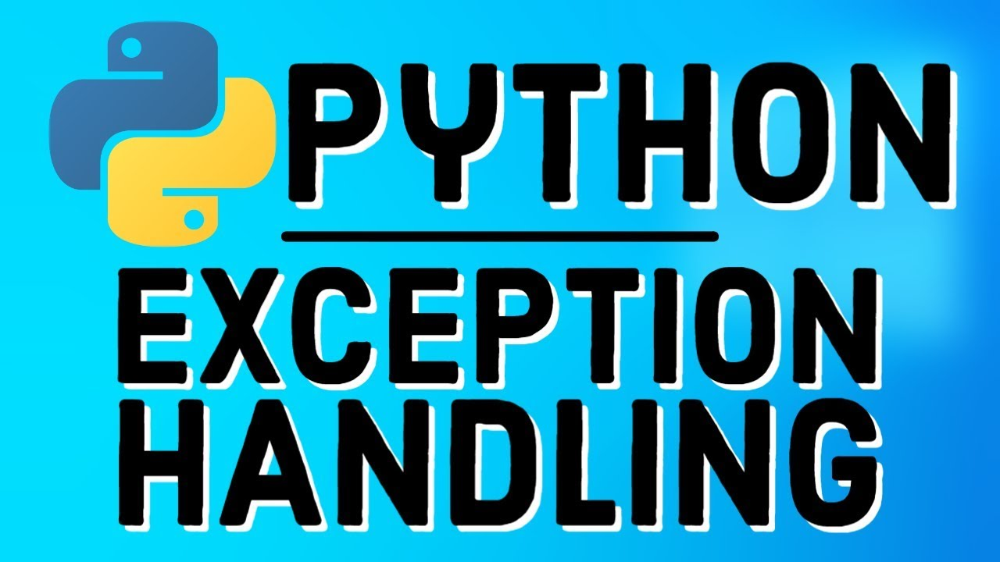

<div align="center">
<br>



</div>


<p align="center">


</p>


<h1 align="center"> Python - Exceptions </h1>


<h3 align="center">
<a href="https://github.com/RazikaBengana/holbertonschool-higher_level_programming/tree/main/python-exceptions#eye-about">About</a> •
<a href="https://github.com/RazikaBengana/holbertonschool-higher_level_programming/tree/main/python-exceptions#hammer_and_wrench-tasks">Tasks</a> •
<a href="https://github.com/RazikaBengana/holbertonschool-higher_level_programming/tree/main/python-exceptions#memo-learning-objectives">Learning Objectives</a> •
<a href="https://github.com/RazikaBengana/holbertonschool-higher_level_programming/tree/main/python-exceptions#computer-requirements">Requirements</a> •
<a href="https://github.com/RazikaBengana/holbertonschool-higher_level_programming/tree/main/python-exceptions#mag_right-resources">Resources</a> •
<a href="https://github.com/RazikaBengana/holbertonschool-higher_level_programming/tree/main/python-exceptions#bust_in_silhouette-authors">Authors</a> •
<a href="https://github.com/RazikaBengana/holbertonschool-higher_level_programming/tree/main/python-exceptions#octocat-license">License</a>
</h3>

---

<!-- ------------------------------------------------------------------------------------------------- -->

<br>
<br>

## :eye: About

<br>

<div align="center">

**`Python - exceptions`** theme introduces error handling and exception management in Python.
<br>
The programs demonstrate various aspects of exception handling, including printing elements of a list safely, dividing numbers with error checks, and creating custom exceptions, all while emphasizing the importance of graceful error management in Python scripts.
<br>
<br>
This project has been created by **[Holberton School](https://www.holbertonschool.com/about-holberton)** to enable every student to understand how Python language works.

</div>

<br>
<br>

<!-- ------------------------------------------------------------------------------------------------- -->

## :hammer_and_wrench: Tasks

<br>

**`0. Safe list printing`**

**`1. Safe printing of an integers list`**

**`2. Print and count integers`**

**`3. Integers division with debug`**

**`4. Divide a list`**

**`5. Raise exception`**

**`6. Raise a message`**

**`7. Safe integer print with error message`**

**`8. Safe function`**

**`9. ByteCode -> Python #4`**

<br>
<br>

<!-- ------------------------------------------------------------------------------------------------- -->

## :memo: Learning Objectives

<br>

**_You are expected to be able to [explain to anyone](https://fs.blog/feynman-learning-technique/), without the help of Google:_**

<br>

```diff

General

+ Why Python programming is awesome

+ What’s the difference between errors and exceptions

+ What are exceptions and how to use them

+ When do we need to use exceptions

+ How to correctly handle an exception

+ What’s the purpose of catching exceptions

+ How to raise a builtin exception

+ When do we need to implement a clean-up action after an exception

```

<br>
<br>

<!-- ------------------------------------------------------------------------------------------------- -->

## :computer: Requirements

<br>

```diff

General

+ Allowed editors: vi, vim, emacs

+ All your files will be interpreted/compiled on Ubuntu 20.04 LTS using python3 (version 3.8.5)

+ All your files should end with a new line

+ The first line of all your files should be exactly #!/usr/bin/python3

+ A README.md file, at the root of the folder of the project, is mandatory

+ Your code should use the pycodestyle (version 2.7.*)

+ All your files must be executable

+ The length of your files will be tested using wc

```

<br>

**_Why all your files should end with a new line? See [HERE](https://unix.stackexchange.com/questions/18743/whats-the-point-in-adding-a-new-line-to-the-end-of-a-file/18789)_**

<br>
<br>

<!-- ------------------------------------------------------------------------------------------------- -->

## :mag_right: Resources

<br>

**_Do you need some help?_**

<br>

**Read or watch:**

* [Errors and Exceptions](https://docs.python.org/3/tutorial/errors.html)

* [Learn to Program 11 Static & Exception Handling](https://www.youtube.com/watch?v=7vbgD-3s-w4)

<br>
<br>

<!-- ------------------------------------------------------------------------------------------------- -->

## :bust_in_silhouette: Authors

<br>


<br>
<br>

<!-- ------------------------------------------------------------------------------------------------- -->

## :octocat: License

<br>

```Python - exceptions``` _project has no license specified._

<br>
<br>

---

<p align="center"><br>2022</p>