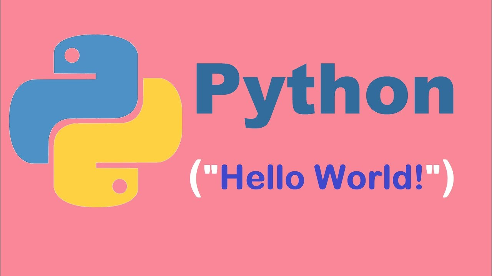

<div align="center">
<br>



</div>


<p align="center">


</p>


<h1 align="center"> Python - Hello, World </h1>


<h3 align="center">
<a href="https://github.com/RazikaBengana/holbertonschool-higher_level_programming/tree/main/python-hello_world#eye-about">About</a> •
<a href="https://github.com/RazikaBengana/holbertonschool-higher_level_programming/tree/main/python-hello_world#hammer_and_wrench-tasks">Tasks</a> •
<a href="https://github.com/RazikaBengana/holbertonschool-higher_level_programming/tree/main/python-hello_world#memo-learning-objectives">Learning Objectives</a> •
<a href="https://github.com/RazikaBengana/holbertonschool-higher_level_programming/tree/main/python-hello_world#computer-requirements">Requirements</a> •
<a href="https://github.com/RazikaBengana/holbertonschool-higher_level_programming/tree/main/python-hello_world#keyboard-more-info">More Info</a> •
<a href="https://github.com/RazikaBengana/holbertonschool-higher_level_programming/tree/main/python-hello_world#mag_right-resources">Resources</a> •
<a href="https://github.com/RazikaBengana/holbertonschool-higher_level_programming/tree/main/python-hello_world#bust_in_silhouette-authors">Authors</a> •
<a href="https://github.com/RazikaBengana/holbertonschool-higher_level_programming/tree/main/python-hello_world#octocat-license">License</a>
</h3>

---

<!-- ------------------------------------------------------------------------------------------------- -->

<br>
<br>

## :eye: About

<br>

<div align="center">

**`Python - hello, World`** theme introduces basic Python programming concepts.
<br>
The programs cover fundamental operations such as printing strings, manipulating variables, working with numbers and strings, and even includes an introduction to Python's philosophy through the **_Zen of Python_**.
<br>
<br>
This project has been created by **[Holberton School](https://www.holbertonschool.com/about-holberton)** to enable every student to understand how Python language works.

</div>

<br>
<br>

<table align="center">
<tr>
<td align="center">

### Author’s Disclaimer

<br>

Welcome to the Python world!

You'll soon find that with Python (and the majority of higher level languages), there are ten different ways to do the same thing.  
Some tasks will expect only one implementation, while other tasks will have multiple possible implementations.  
Python has a linter / style guide, called PEP8, also now known as PyCode.  
At Holberton, we won't start off with using PyCode, because it's much more strict compared to PEP8.  
Don't worry if you see a warning when you are running PEP8, you can ignore it.

Enjoy!

Guillaume - _Holberton School_

<br>

</td>
</tr>
</table>

<br>
<br>

<!-- ------------------------------------------------------------------------------------------------- -->

## :hammer_and_wrench: Tasks

<br>

**`0. Hello, print`**

**`1. Print integer`**

**`2. Print float`**

**`3. Print string`**

**`4. Play with strings`**

**`5. Copy - Cut - Paste`**

**`6. Create a new sentence`**

**`7. Easter Egg`**

<br>
<br>

<!-- ------------------------------------------------------------------------------------------------- -->

## :memo: Learning objectives

<br>

**_You are expected to be able to [explain to anyone](https://fs.blog/feynman-learning-technique/), without the help of Google:_**

<br>

```diff

General

+ How to use the Python interpreter

+ How to print text and variables using print

+ How to use strings

+ What are indexing and slicing in Python

+ What is the official Python coding style and how to check your code with pycodestyle

```

<br>
<br>

<!-- ------------------------------------------------------------------------------------------------- -->

## :computer: Requirements

<br>

```diff

Python Scripts

+ Allowed editors: vi, vim, emacs

+ All your files will be interpreted/compiled on Ubuntu 20.04 LTS using python3 (version 3.8.*)

+ All your files should end with a new line

+ The first line of all your files should be exactly #!/usr/bin/python3

+ A README.md file at the root of the repo, containing a description of the repository

+ A README.md file, at the root of the folder of this project, is mandatory

+ Your code should use the pycodestyle (version 2.7.*)

+ All your files must be executable

+ The length of your files will be tested using wc

```

<br>

**_Why all your files should end with a new line? See [HERE](https://unix.stackexchange.com/questions/18743/whats-the-point-in-adding-a-new-line-to-the-end-of-a-file/18789)_**

<br>
<br>

<!-- ------------------------------------------------------------------------------------------------- -->

## :keyboard: More Info

<br>

### Pycodestyle:

<br>

- `Pycodestyle` is now the [new standard of Python style code](https://github.com/PyCQA/pycodestyle/issues/466).

<br>
<br>

<!-- ------------------------------------------------------------------------------------------------- -->

## :mag_right: Resources

<br>

**_Do you need some help?_**

<br>

**Concepts:**

* [Python programming](https://drive.google.com/file/d/15GsFIeM9vMS24rQEmfCOT0_BJua8Z0jv/view?usp=sharing)

<br>

**Read or watch:**

* [Learn to Program](https://www.youtube.com/playlist?list=PLGLfVvz_LVvTn3cK5e6LjhgGiSeVlIRwt&cbrd=1&ucbcb=1)

* [Whetting Your Appetite](https://docs.python.org/3/tutorial/appetite.html)

* [Using the Python Interpreter](https://docs.python.org/3/tutorial/interpreter.html)

* [An Informal Introduction to Python](https://docs.python.org/3/tutorial/introduction.html)

* [How To Use String Formatters in Python 3](https://realpython.com/python-f-strings/)

* [Pycodestyle – Style Guide for Python Code](https://pypi.org/project/pycodestyle/)

<br>
<br>

<!-- ------------------------------------------------------------------------------------------------- -->

## :bust_in_silhouette: Authors

<br>

**${\color{blue}Razika \space Bengana}$**

<br>
<br>

<!-- ------------------------------------------------------------------------------------------------- -->

## :octocat: License

<br>

```Python - hello, World``` _project has no license specified._

<br>
<br>

---

<p align="center"><br>2022</p>