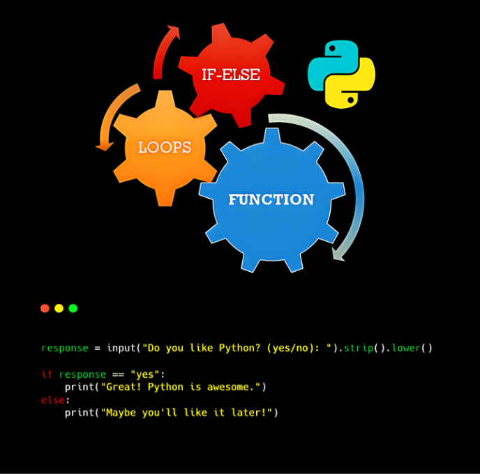

<div align="center">
<br>



</div>


<p align="center">


</p>


<h1 align="center"> Python - if/else, loops, functions </h1>


<h3 align="center">
<a href="https://github.com/RazikaBengana/holbertonschool-higher_level_programming/tree/main/python-python-if_else_loops_functions#eye-about">About</a> •
<a href="https://github.com/RazikaBengana/holbertonschool-higher_level_programming/tree/main/python-python-if_else_loops_functions#hammer_and_wrench-tasks">Tasks</a> •
<a href="https://github.com/RazikaBengana/holbertonschool-higher_level_programming/tree/main/python-python-if_else_loops_functions#memo-learning-objectives">Learning Objectives</a> •
<a href="https://github.com/RazikaBengana/holbertonschool-higher_level_programming/tree/main/python-python-if_else_loops_functions#computer-requirements">Requirements</a> •
<a href="https://github.com/RazikaBengana/holbertonschool-higher_level_programming/tree/main/python-python-if_else_loops_functions#keyboard-more-info">More Info</a> •
<a href="https://github.com/RazikaBengana/holbertonschool-higher_level_programming/tree/main/python-python-if_else_loops_functions#mag_right-resources">Resources</a> •
<a href="https://github.com/RazikaBengana/holbertonschool-higher_level_programming/tree/main/python-python-if_else_loops_functions#bust_in_silhouette-authors">Authors</a> •
<a href="https://github.com/RazikaBengana/holbertonschool-higher_level_programming/tree/main/python-python-if_else_loops_functions#octocat-license">License</a>
</h3>

---

<!-- ------------------------------------------------------------------------------------------------- -->

<br>
<br>

## :eye: About

<br>

<div align="center">

**`Python - if/else, loops, functions`** theme introduces fundamental control structures and function definitions in Python.
<br>
The programs cover topics such as conditional statements, loops, generating random numbers, working with strings and numbers, and defining simple functions to perform various tasks like checking character cases, printing patterns, and implementing basic algorithms.
<br>
<br>
This project has been created by **[Holberton School](https://www.holbertonschool.com/about-holberton)** to enable every student to understand how Python language works.

</div>

<br>
<br>

<!-- ------------------------------------------------------------------------------------------------- -->

## :hammer_and_wrench: Tasks

<br>

**`0. Positive anything is better than negative nothing`**

**`1. The last digit`**

**`2. I sometimes suffer from insomnia. And when I can't fall asleep, I play what I call the alphabet game`**

**`3. When I was having that alphabet soup, I never thought that it would pay off`**

**`4. Hexadecimal printing`**

**`5. 00...99`**

**`6. Inventing is a combination of brains and materials. The more brains you use, the less material you need`**

**`7. islower`**

**`8. To uppercase`**

**`9. There are only 3 colors, 10 digits, and 7 notes; it's what we do with them that's important`**

**`10. a + b`**

**`11. a ^ b`**

**`12. Fizz Buzz`**

**`13. Smile in the mirror`**

**`14. Remove at position`**

<br>
<br>

<!-- ------------------------------------------------------------------------------------------------- -->

## :memo: Learning Objectives

<br>

**_You are expected to be able to [explain to anyone](https://fs.blog/feynman-learning-technique/), without the help of Google:_**

<br>

```diff

General

+ Why indentation is so important in Python

+ How to use the if, if ... else statements

+ How to use comments

+ How to affect values to variables

+ How to use the while and for loops

+ How to use the break and continues statements

+ How to use else clauses on loops

+ What does the pass statement do, and when to use it

+ How to use range

+ What is a function and how do you use functions

+ What does return a function that does not use any return statement

+ Scope of variables

+ What’s a traceback

+ What are the arithmetic operators and how to use them

```

<br>
<br>

<!-- ------------------------------------------------------------------------------------------------- -->

## :computer: Requirements

<br>

```diff

Python Scripts

+ Allowed editors: vi, vim, emacs

+ All your files will be interpreted/compiled on Ubuntu 20.04 LTS using python3 (version 3.8.*)

+ All your files should end with a new line

+ The first line of all your files should be exactly #!/usr/bin/python3

+ A README.md file, at the root of the folder of the project, is mandatory

+ Your code should use the pycodestyle (version 2.7.*)

+ All your files must be executable

+ The length of your files will be tested using wc

```

<br>

**_Why all your files should end with a new line? See [HERE](https://unix.stackexchange.com/questions/18743/whats-the-point-in-adding-a-new-line-to-the-end-of-a-file/18789)_**

<br>
<br>

<!-- ------------------------------------------------------------------------------------------------- -->

## :keyboard: More Info

<br>

- You do not need to understand **lists** yet.

<br>
<br>

<!-- ------------------------------------------------------------------------------------------------- -->

## :mag_right: Resources

<br>

**_Do you need some help?_**

<br>

**Read or watch:**

* [More Control Flow Tools](https://docs.python.org/3/tutorial/controlflow.html)

* [IndentationError](https://www.youtube.com/watch?v=1QXOd2ZQs-Q)

* [How To Use String Formatters in Python 3](https://www.digitalocean.com/community/tutorials/how-to-use-string-formatters-in-python-3)

* [Learn to Program 2 : Looping](https://www.youtube.com/watch?v=swQEbZ6ez1I&list=PLGLfVvz_LVvTn3cK5e6LjhgGiSeVlIRwt&index=2)

* [Pycodestyle – Style Guide for Python Code](https://pypi.org/project/pycodestyle/)

<br>

**`man` or `help`:**

* `python3`

<br>
<br>

<!-- ------------------------------------------------------------------------------------------------- -->

## :bust_in_silhouette: Authors

<br>


<br>
<br>

<!-- ------------------------------------------------------------------------------------------------- -->

## :octocat: License

<br>

```Python - if/else, loops, functions``` _project has no license specified._

<br>
<br>

---

<p align="center"><br>2022</p>