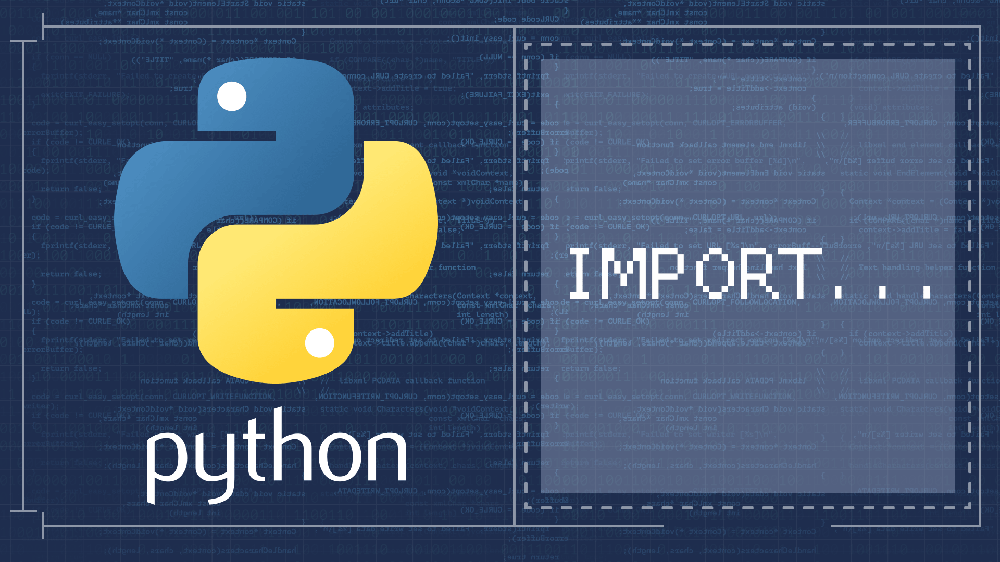

<div align="center">
<br>



</div>


<p align="center">


</p>


<h1 align="center"> Python - import & modules </h1>


<h3 align="center">
<a href="https://github.com/RazikaBengana/holbertonschool-higher_level_programming/tree/main/python-import_modules#eye-about">About</a> •
<a href="https://github.com/RazikaBengana/holbertonschool-higher_level_programming/tree/main/python-import_modules#hammer_and_wrench-tasks">Tasks</a> •
<a href="https://github.com/RazikaBengana/holbertonschool-higher_level_programming/tree/main/python-import_modules#memo-learning-objectives">Learning Objectives</a> •
<a href="https://github.com/RazikaBengana/holbertonschool-higher_level_programming/tree/main/python-import_modules#computer-requirements">Requirements</a> •
<a href="https://github.com/RazikaBengana/holbertonschool-higher_level_programming/tree/main/python-import_modules#mag_right-resources">Resources</a> •
<a href="https://github.com/RazikaBengana/holbertonschool-higher_level_programming/tree/main/python-import_modules#bust_in_silhouette-authors">Authors</a> •
<a href="https://github.com/RazikaBengana/holbertonschool-higher_level_programming/tree/main/python-import_modules#octocat-license">License</a>
</h3>

---

<!-- ------------------------------------------------------------------------------------------------- -->

<br>
<br>

## :eye: About

<br>

<div align="center">

**`Python - import & modules`** theme introduces the concept of importing and using modules in Python.
<br>
The programs demonstrate various aspects of module importation, including importing specific functions, handling command-line arguments, performing calculations with imported functions, and exploring different techniques for module usage in Python scripts.
<br>
<br>
This project has been created by **[Holberton School](https://www.holbertonschool.com/about-holberton)** to enable every student to understand how Python language works.

</div>

<br>
<br>

<!-- ------------------------------------------------------------------------------------------------- -->

## :hammer_and_wrench: Tasks

<br>

**`0. Import a simple function from a simple file`**

**`1. My first toolbox!`**

**`2. How to make a script dynamic!`**

**`3. Infinite addition`**

**`4. Who are you?`**

**`5. Everything can be imported`**

**`6. Build my own calculator!`**

**`7. Easy print`**

**`8. ByteCode -> Python #3`**

**`9. Fast alphabet`**

<br>
<br>

<!-- ------------------------------------------------------------------------------------------------- -->

## :memo: Learning objectives

<br>

**_You are expected to be able to [explain to anyone](https://fs.blog/feynman-learning-technique/), without the help of Google:_**

<br>

```diff

General

+ Why Python programming is awesome

+ How to import functions from another file

+ How to use imported functions

+ How to create a module

+ How to use the built-in function dir()

+ How to prevent code in your script from being executed when imported

+ How to use command line arguments with your Python programs

```

<br>
<br>

<!-- ------------------------------------------------------------------------------------------------- -->

## :computer: Requirements

<br>

```diff

General

+ Allowed editors: vi, vim, emacs

+ All your files will be interpreted/compiled on Ubuntu 20.04 LTS using python3 (version 3.9.*)

+ All your files should end with a new line

+ The first line of all your files should be exactly #!/usr/bin/python3

+ A README.md file, at the root of the folder of the project, is mandatory

+ Your code should use the pycodestyle (version 2.7.*)

+ All your files must be executable

+ The length of your files will be tested using wc

```

<br>

**_Why all your files should end with a new line? See [HERE](https://unix.stackexchange.com/questions/18743/whats-the-point-in-adding-a-new-line-to-the-end-of-a-file/18789)_**

<br>
<br>

<!-- ------------------------------------------------------------------------------------------------- -->

## :mag_right: Resources

<br>

**_Do you need some help?_**

<br>

**Read or watch:**

* [Modules](https://docs.python.org/3/tutorial/modules.html)

* [Command line arguments](https://docs.python.org/3/tutorial/stdlib.html#command-line-arguments)

* [Pycodestyle – Style Guide for Python Code](https://pypi.org/project/pycodestyle/)

<br>

**`man` or `help`:**

* `python3`

<br>
<br>

<!-- ------------------------------------------------------------------------------------------------- -->

## :bust_in_silhouette: Authors

<br>

**${\color{blue}Razika \space Bengana}$**

<br>
<br>

<!-- ------------------------------------------------------------------------------------------------- -->

## :octocat: License

<br>

```Python - import & modules``` _project has no license specified._

<br>
<br>

---

<p align="center"><br>2022</p>