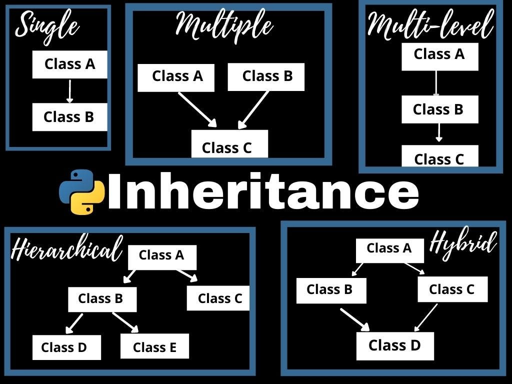

<div align="center">
<br>



</div>


<p align="center">


</p>


<h1 align="center"> Python - Inheritance </h1>


<h3 align="center">
<a href="https://github.com/RazikaBengana/holbertonschool-higher_level_programming/tree/main/python-inheritance#eye-about">About</a> •
<a href="https://github.com/RazikaBengana/holbertonschool-higher_level_programming/tree/main/python-inheritance#hammer_and_wrench-tasks">Tasks</a> •
<a href="https://github.com/RazikaBengana/holbertonschool-higher_level_programming/tree/main/python-inheritance#memo-learning-objectives">Learning Objectives</a> •
<a href="https://github.com/RazikaBengana/holbertonschool-higher_level_programming/tree/main/python-inheritance#computer-requirements">Requirements</a> •
<a href="https://github.com/RazikaBengana/holbertonschool-higher_level_programming/tree/main/python-inheritance#mag_right-resources">Resources</a> •
<a href="https://github.com/RazikaBengana/holbertonschool-higher_level_programming/tree/main/python-inheritance#bust_in_silhouette-authors">Authors</a> •
<a href="https://github.com/RazikaBengana/holbertonschool-higher_level_programming/tree/main/python-inheritance#octocat-license">License</a>
</h3>

---

<!-- ------------------------------------------------------------------------------------------------- -->

<br>
<br>

## :eye: About

<br>

<div align="center">

**`Python - inheritance`** theme explores the concept of class inheritance, a fundamental principle of object-oriented programming.
<br>
The programs demonstrate various aspects of inheritance, including creating subclasses, method overriding, and using built-in functions like `isinstance()` and `issubclass()`, while also introducing concepts such as multiple inheritance and abstract base classes.
<br>
<br>
This project has been created by **[Holberton School](https://www.holbertonschool.com/about-holberton)** to enable every student to understand how Python language works.

</div>

<br>
<br>

<!-- ------------------------------------------------------------------------------------------------- -->

## :hammer_and_wrench: Tasks

<br>

**`0. Lookup`**

**`1. My list`**

**`2. Exact same object`**

**`3. Same class or inherit from`**

**`4. Only sub class of`**

**`5. Geometry module`**

**`6. Improve Geometry`**

**`7. Integer validator`**

**`8. Rectangle`**

**`9. Full rectangle`**

**`10. Square #1`**

**`11. Square #2`**

**`12. My integer`**

**`13. Can I?`**

<br>
<br>

<!-- ------------------------------------------------------------------------------------------------- -->

## :memo: Learning Objectives

<br>

**_You are expected to be able to [explain to anyone](https://fs.blog/feynman-learning-technique/), without the help of Google:_**

<br>

```diff

General

+ What is a superclass, baseclass or parentclass

+ What is a subclass

+ How to list all attributes and methods of a class or instance

+ When can an instance have new attributes

+ How to inherit class from another

+ How to define a class with multiple base classes

+ What is the default class every class inherit from

+ How to override a method or attribute inherited from the base class

+ Which attributes or methods are available by heritage to subclasses

+ What is the purpose of inheritance

+ What are, when and how to use isinstance, issubclass, type and super built-in functions

```

<br>
<br>

<!-- ------------------------------------------------------------------------------------------------- -->

## :computer: Requirements

<br>

```diff

Python Scripts

+ Allowed editors: vi, vim, emacs

+ All your files will be interpreted/compiled on Ubuntu 20.04 LTS using python3 (version 3.8.5)

+ All your files should end with a new line

+ The first line of all your files should be exactly #!/usr/bin/python3

+ A README.md file, at the root of the folder of the project, is mandatory

+ Your code should use the pycodestyle (version 2.7.*)

+ All your files must be executable

+ The length of your files will be tested using wc


Python Test Cases

+ Allowed editors: vi, vim, emacs

+ All your files should end with a new line

+ All your test files should be inside a folder tests

+ All your test files should be text files (extension: .txt)

+ All your tests should be executed by using this command: python3 -m doctest ./tests/*

+ All your modules should have a documentation (python3 -c 'print(__import__("my_module").__doc__)')

+ All your classes should have a documentation (python3 -c 'print(__import__("my_module").MyClass.__doc__)')

+ All your functions (inside and outside a class) should have a documentation (python3 -c 'print(__import__("my_module").my_function.__doc__)' and python3 -c 'print(__import__("my_module").MyClass.my_function.__doc__)')

+ A documentation is not a simple word, it’s a real sentence explaining what’s the purpose of the module, class or method (the length of it will be verified)

+ We strongly encourage you to work together on test cases, so that you don’t miss any edge case


Documentation

- Do not use the words import or from inside your comments, the checker will think you are trying to import some modules

```

<br>

**_Why all your files should end with a new line? See [HERE](https://unix.stackexchange.com/questions/18743/whats-the-point-in-adding-a-new-line-to-the-end-of-a-file/18789)_**

<br>
<br>

<!-- ------------------------------------------------------------------------------------------------- -->

## :mag_right: Resources

<br>

**_Do you need some help?_**

<br>

**Read or watch:**

* [Inheritance](https://docs.python.org/3/tutorial/classes.html#inheritance)

* [Multiple inheritance](https://docs.python.org/3/tutorial/classes.html#multiple-inheritance)

* [Inheritance in Python](https://hub.packtpub.com/inheritance-python/)

* [Learn to Program 10 : Inheritance Magic Methods](https://www.youtube.com/watch?v=d8kCdLCi6Lk)

<br>
<br>

<!-- ------------------------------------------------------------------------------------------------- -->

## :bust_in_silhouette: Authors

<br>


<br>
<br>

<!-- ------------------------------------------------------------------------------------------------- -->

## :octocat: License

<br>

```Python - inheritance``` _project has no license specified._

<br>
<br>

---

<p align="center"><br>2022</p>