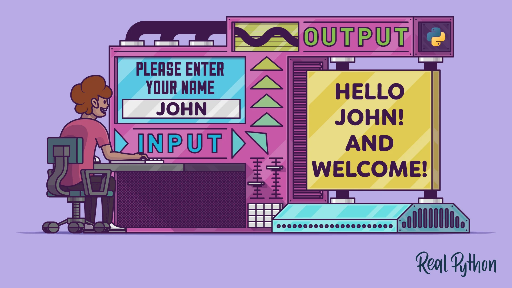

<div align="center">
<br>



</div>


<p align="center">


</p>


<h1 align="center"> Python - Input/Output </h1>


<h3 align="center">
<a href="https://github.com/RazikaBengana/holbertonschool-higher_level_programming/tree/main/python-input_output#eye-about">About</a> •
<a href="https://github.com/RazikaBengana/holbertonschool-higher_level_programming/tree/main/python-input_output#hammer_and_wrench-tasks">Tasks</a> •
<a href="https://github.com/RazikaBengana/holbertonschool-higher_level_programming/tree/main/python-input_output#memo-learning-objectives">Learning Objectives</a> •
<a href="https://github.com/RazikaBengana/holbertonschool-higher_level_programming/tree/main/python-input_output#computer-requirements">Requirements</a> •
<a href="https://github.com/RazikaBengana/holbertonschool-higher_level_programming/tree/main/python-input_output#mag_right-resources">Resources</a> •
<a href="https://github.com/RazikaBengana/holbertonschool-higher_level_programming/tree/main/python-input_output#bust_in_silhouette-authors">Authors</a> •
<a href="https://github.com/RazikaBengana/holbertonschool-higher_level_programming/tree/main/python-input_output#octocat-license">License</a>
</h3>

---

<!-- ------------------------------------------------------------------------------------------------- -->

<br>
<br>

## :eye: About

<br>

<div align="center">

**`Python - input/output`** theme explores file handling, JSON serialization, and deserialization in Python.
<br>
The programs demonstrate various `I/O` operations such as reading from and writing to files, converting between Python objects and JSON, and implementing classes with JSON-related methods.
<br>
<br>
This project has been created by **[Holberton School](https://www.holbertonschool.com/about-holberton)** to enable every student to understand how Python language works.

</div>

<br>
<br>

<!-- ------------------------------------------------------------------------------------------------- -->

## :hammer_and_wrench: Tasks

<br>

**`0. Read file`**

**`1. Write to a file`**

**`2. Append to a file`**

**`3. To JSON string`**

**`4. From JSON string to Object`**

**`5. Save Object to a file`**

**`6. Create object from a JSON file`**

**`7. Load, add, save`**

**`8. Class to JSON`**

**`9. Student to JSON`**

**`10. Student to JSON with filter`**

**`11. Student to disk and reload`**

**`12. Pascal's Triangle`**

**`13. Search and update`**

**`14. Log parsing`**

<br>
<br>

<!-- ------------------------------------------------------------------------------------------------- -->

## :memo: Learning Objectives

<br>

**_You are expected to be able to [explain to anyone](https://fs.blog/feynman-learning-technique/), without the help of Google:_**

<br>

```diff

General

+ Why Python programming is awesome

+ How to open a file

+ How to write text in a file

+ How to read the full content of a file

+ How to read a file line by line

+ How to move the cursor in a file

+ How to make sure a file is closed after using it

+ What is and how to use the with statement

+ What is JSON

+ What is serialization

+ What is deserialization

+ How to convert a Python data structure to a JSON string

+ How to convert a JSON string to a Python data structure

+ How to access command line parameters in a Python script

```

<br>
<br>

<!-- ------------------------------------------------------------------------------------------------- -->

## :computer: Requirements

<br>

```diff

Python Scripts

+ Allowed editors: vi, vim, emacs

+ All your files will be interpreted/compiled on Ubuntu 20.04 LTS using python3 (version 3.8.5)

+ All your files should end with a new line

+ The first line of all your files should be exactly #!/usr/bin/python3

+ A README.md file, at the root of the folder of the project, is mandatory

+ Your code should use the pycodestyle (version 2.7.*)

+ All your files must be executable

+ The length of your files will be tested using wc


Python Test Cases

+ Allowed editors: vi, vim, emacs

+ All your files should end with a new line

+ All your test files should be inside a folder tests

+ All your test files should be text files (extension: .txt)

+ All your tests should be executed by using this command: python3 -m doctest ./tests/*

+ All your modules should have a documentation (python3 -c 'print(__import__("my_module").__doc__)')

+ All your classes should have a documentation (python3 -c 'print(__import__("my_module").MyClass.__doc__)')

+ All your functions (inside and outside a class) should have a documentation (python3 -c 'print(__import__("my_module").my_function.__doc__)' and python3 -c 'print(__import__("my_module").MyClass.my_function.__doc__)')

+ A documentation is not a simple word, it’s a real sentence explaining what’s the purpose of the module, class or method (the length of it will be verified)

+ We strongly encourage you to work together on test cases, so that you don’t miss any edge case

```

<br>

**_Why all your files should end with a new line? See [HERE](https://unix.stackexchange.com/questions/18743/whats-the-point-in-adding-a-new-line-to-the-end-of-a-file/18789)_**

<br>
<br>

<!-- ------------------------------------------------------------------------------------------------- -->

## :mag_right: Resources

<br>

**_Do you need some help?_**

<br>

**Read or watch:**

* [7.2. Reading and Writing Files](https://docs.python.org/3/tutorial/inputoutput.html#reading-and-writing-files)

* [8.7. Predefined Clean-up Actions](https://docs.python.org/3/tutorial/errors.html#predefined-clean-up-actions)

* [Dive Into Python 3: Chapter 11. Files](https://histo.ucsf.edu/BMS270/diveintopython3-r802.pdf)

* [JSON encoder and decoder](https://docs.python.org/3/library/json.html)

* [Learn to Program 8 : Reading / Writing Files](https://www.youtube.com/watch?v=EukxMIsNeqU)

* [Automate the Boring Stuff with Python](https://automatetheboringstuff.com/)

* [sys package](https://docs.python.org/3/library/sys.html)

<br>
<br>

<!-- ------------------------------------------------------------------------------------------------- -->

## :bust_in_silhouette: Authors

<br>


<br>
<br>

<!-- ------------------------------------------------------------------------------------------------- -->

## :octocat: License

<br>

```Python - input/output``` _project has no license specified._

<br>
<br>

---

<p align="center"><br>2022</p>