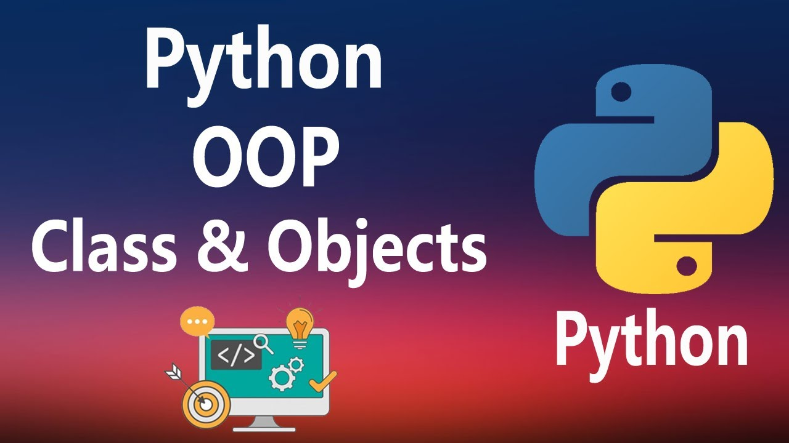

<div align="center">
<br>



</div>


<p align="center">


</p>


<h1 align="center"> Python - More Classes and Objects </h1>


<h3 align="center">
<a href="https://github.com/RazikaBengana/holbertonschool-higher_level_programming/tree/main/python-more_classes#eye-about">About</a> •
<a href="https://github.com/RazikaBengana/holbertonschool-higher_level_programming/tree/main/python-more_classes#hammer_and_wrench-tasks">Tasks</a> •
<a href="https://github.com/RazikaBengana/holbertonschool-higher_level_programming/tree/main/python-more_classes#memo-learning-objectives">Learning Objectives</a> •
<a href="https://github.com/RazikaBengana/holbertonschool-higher_level_programming/tree/main/python-more_classes#computer-requirements">Requirements</a> •
<a href="https://github.com/RazikaBengana/holbertonschool-higher_level_programming/tree/main/python-more_classes#mag_right-resources">Resources</a> •
<a href="https://github.com/RazikaBengana/holbertonschool-higher_level_programming/tree/main/python-more_classes#bust_in_silhouette-authors">Authors</a> •
<a href="https://github.com/RazikaBengana/holbertonschool-higher_level_programming/tree/main/python-more_classes#octocat-license">License</a>
</h3>

---

<!-- ------------------------------------------------------------------------------------------------- -->

<br>
<br>

## :eye: About

<br>

<div align="center">

**`Python - more classes and objects`** theme delves deeper into advanced object-oriented programming concepts in Python.
<br>
The programs focus on creating a more complex Rectangle class, exploring topics such as class and static methods, class variables for instance tracking, string representations of objects, and comparison between instances, showcasing how to build robust and feature-rich classes in Python.
<br>
<br>
This project has been created by **[Holberton School](https://www.holbertonschool.com/about-holberton)** to enable every student to understand how Python language works.

</div>

<br>
<br>

<!-- ------------------------------------------------------------------------------------------------- -->

## :hammer_and_wrench: Tasks

<br>

**`0. Simple rectangle`**

**`1. Real definition of a rectangle`**

**`2. Area and Perimeter`**

**`3. String representation`**

**`4. Eval is magic`**

**`5. Detect instance deletion`**

**`6. How many instances`**

**`7. Change representation`**

**`8. Compare rectangles`**

**`9. A square is a rectangle`**

**`10. Class and instance attributes`** 

**`11. N queens`**

<br>
<br>

<!-- ------------------------------------------------------------------------------------------------- -->

## :memo: Learning objectives

<br>

**_You are expected to be able to [explain to anyone](https://fs.blog/feynman-learning-technique/), without the help of Google:_**

<br>

```diff

General

+ Why Python programming is awesome

+ What is OOP

+ “first-class everything”

+ What is a class

+ What is an object and an instance

+ What is the difference between a class and an object or instance

+ What is an attribute

+ What are and how to use public, protected and private attributes

+ What is self

+ What is a method

+ What is the special __init__ method and how to use it

+ What is Data Abstraction, Data Encapsulation, and Information Hiding

+ What is a property

+ What is the difference between an attribute and a property in Python

+ What is the Pythonic way to write getters and setters in Python

+ What are the special __str__ and __repr__ methods and how to use them

+ What is the difference between __str__ and __repr__

+ What is a class attribute

+ What is the difference between a object attribute and a class attribute

+ What is a class method

+ What is a static method

+ How to dynamically create arbitrary new attributes for existing instances of a class

+ How to bind attributes to object and classes

+ What is and what does contain __dict__ of a class and of an instance of a class

+ How does Python find the attributes of an object or class

+ How to use the getattr function

```

<br>
<br>

<!-- ------------------------------------------------------------------------------------------------- -->

## :computer: Requirements

<br>

```diff

General

+ Allowed editors: vi, vim, emacs

+ All your files will be interpreted/compiled on Ubuntu 20.04 LTS using python3 (version 3.8.5)

+ All your files should end with a new line

+ The first line of all your files should be exactly #!/usr/bin/python3

+ A README.md file, at the root of the folder of the project, is mandatory

+ Your code should use the pycodestyle (version 2.7.*)

+ All your files must be executable

+ The length of your files will be tested using wc

```

<br>

**_Why all your files should end with a new line? See [HERE](https://unix.stackexchange.com/questions/18743/whats-the-point-in-adding-a-new-line-to-the-end-of-a-file/18789)_**

<br>
<br>

<!-- ------------------------------------------------------------------------------------------------- -->

## :mag_right: Resources

<br>

**_Do you need some help?_**

<br>

**Read or watch:**

* [Object Oriented Programming (1)](https://python.swaroopch.com/oop.html)

* [Object Oriented Programming (2)](https://python-course.eu/oop/object-oriented-programming.php)

* [Class and Instance Attributes](https://python-course.eu/oop/class-instance-attributes.php)

* [classmethods and staticmethods](https://www.youtube.com/watch?v=rq8cL2XMM5M)

* [Properties vs. Getters and Setters](https://python-course.eu/oop/properties-vs-getters-and-setters.php)

* [str vs repr](https://shipit.dev/posts/python-str-vs-repr.html)

<br>
<br>

<!-- ------------------------------------------------------------------------------------------------- -->

## :bust_in_silhouette: Authors

<br>

**${\color{blue}Razika \space Bengana}$**

<br>
<br>

<!-- ------------------------------------------------------------------------------------------------- -->

## :octocat: License

<br>

```Python - more classes and objects``` _project has no license specified._

<br>
<br>

---

<p align="center"><br>2022</p>