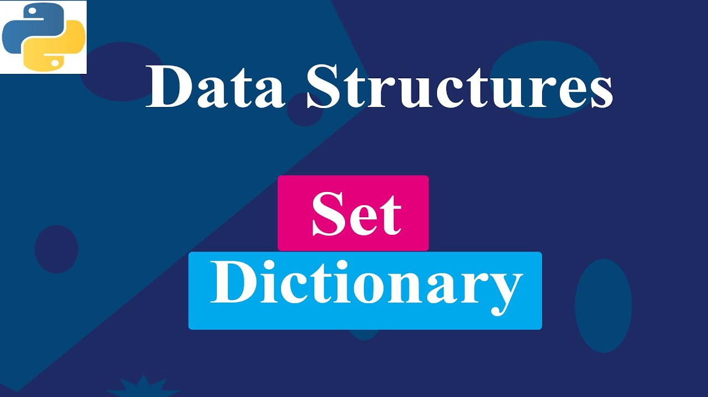

<div align="center">
<br>



</div>


<p align="center">


</p>


<h1 align="center"> Python - More Data Structures: Set, Dictionary </h1>


<h3 align="center">
<a href="https://github.com/RazikaBengana/holbertonschool-higher_level_programming/tree/main/python-more_data_structures#eye-about">About</a> •
<a href="https://github.com/RazikaBengana/holbertonschool-higher_level_programming/tree/main/python-more_data_structures#hammer_and_wrench-tasks">Tasks</a> •
<a href="https://github.com/RazikaBengana/holbertonschool-higher_level_programming/tree/main/python-more_data_structures#memo-learning-objectives">Learning Objectives</a> •
<a href="https://github.com/RazikaBengana/holbertonschool-higher_level_programming/tree/main/python-more_data_structures#computer-requirements">Requirements</a> •
<a href="https://github.com/RazikaBengana/holbertonschool-higher_level_programming/tree/main/python-more_data_structures#mag_right-resources">Resources</a> •
<a href="https://github.com/RazikaBengana/holbertonschool-higher_level_programming/tree/main/python-more_data_structures#bust_in_silhouette-authors">Authors</a> •
<a href="https://github.com/RazikaBengana/holbertonschool-higher_level_programming/tree/main/python-more_data_structures#octocat-license">License</a>
</h3>

---

<!-- ------------------------------------------------------------------------------------------------- -->

<br>
<br>

## :eye: About

<br>

<div align="center">

**`Python - more data structures: set, dictionary`** theme explores advanced data manipulation techniques in Python.
<br>
The programs cover operations on `sets` and `dictionaries`, including squaring matrix elements, searching and replacing in lists, finding maximum values in dictionaries, calculating weighted averages, and working with Roman numerals, all while emphasizing efficient use of Python's built-in functions and data structure methods.
<br>
<br>
This project has been created by **[Holberton School](https://www.holbertonschool.com/about-holberton)** to enable every student to understand how Python language works.

</div>

<br>
<br>

<!-- ------------------------------------------------------------------------------------------------- -->

## :hammer_and_wrench: Tasks

<br>

**`0. Squared simple`**

**`1. Search and replace`**

**`2. Unique addition`**

**`3. Present in both`**

**`4. Only differents`**

**`5. Number of keys`**

**`6. Print sorted dictionary`**

**`7. Update dictionary`**

**`8. Simple delete by key`**

**`9. Multiply by 2`**

**`10. Best score`**

**`11. Multiply by using map`**

**`12. Roman to Integer`**

**`13. Weighted average!`**

**`14. Squared by using map`**

**`15. Delete by value`**

<br>
<br>

<!-- ------------------------------------------------------------------------------------------------- -->

## :memo: Learning objectives

<br>

**_You are expected to be able to [explain to anyone](https://fs.blog/feynman-learning-technique/), without the help of Google:_**

<br>

```diff

General

+ Why Python programming is awesome

+ What are sets and how to use them

+ What are the most common methods of set and how to use them

+ When to use sets versus lists

+ How to iterate into a set

+ What are dictionaries and how to use them

+ When to use dictionaries versus lists or sets

+ What is a key in a dictionary

+ How to iterate over a dictionary

+ What is a lambda function

+ What are the map, reduce and filter functions

```

<br>
<br>

<!-- ------------------------------------------------------------------------------------------------- -->

## :computer: Requirements

<br>

```diff

General

+ Allowed editors: vi, vim, emacs

+ All your files will be interpreted/compiled on Ubuntu 20.04 LTS using python3 (version 3.8.5)

+ All your files should end with a new line

+ The first line of all your files should be exactly #!/usr/bin/python3

+ A README.md file, at the root of the folder of the project, is mandatory

+ Your code should use the pycodestyle (version 2.7.*)

+ All your files must be executable

+ The length of your files will be tested using wc

```

<br>

**_Why all your files should end with a new line? See [HERE](https://unix.stackexchange.com/questions/18743/whats-the-point-in-adding-a-new-line-to-the-end-of-a-file/18789)_**

<br>
<br>

<!-- ------------------------------------------------------------------------------------------------- -->

## :mag_right: Resources

<br>

**_Do you need some help?_**

<br>

**Read or watch:**

* [Data structures](https://docs.python.org/3/tutorial/datastructures.html)

* [Lambda, filter, reduce and map](https://python-course.eu/advanced-python/lambda-filter-reduce-map.php)

* [Learn to Program 12 Lambda Map Filter Reduce](https://www.youtube.com/watch?v=1GAC6KQUPeg)

<br>

**`man` or `help`:**

* `python3`

<br>
<br>

<!-- ------------------------------------------------------------------------------------------------- -->

## :bust_in_silhouette: Authors

<br>

**${\color{blue}Razika \space Bengana}$**

<br>
<br>

<!-- ------------------------------------------------------------------------------------------------- -->

## :octocat: License

<br>

```Python - more data structures: set, dictionary``` _project has no license specified._

<br>
<br>

---

<p align="center"><br>2022</p>