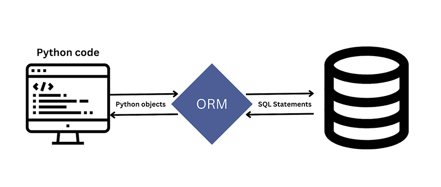

<div align="center">
<br>



</div>


<p align="center">


</p>


<h1 align="center"> Python - Object-relational mapping </h1>


<h3 align="center">
<a href="https://github.com/RazikaBengana/holbertonschool-higher_level_programming/tree/main/python-object_relational_mapping#eye-about">About</a> •
<a href="https://github.com/RazikaBengana/holbertonschool-higher_level_programming/tree/main/python-object_relational_mapping#hammer_and_wrench-tasks">Tasks</a> •
<a href="https://github.com/RazikaBengana/holbertonschool-higher_level_programming/tree/main/python-object_relational_mapping#memo-learning-objectives">Learning Objectives</a> •
<a href="https://github.com/RazikaBengana/holbertonschool-higher_level_programming/tree/main/python-object_relational_mapping#computer-requirements">Requirements</a> •
<a href="https://github.com/RazikaBengana/holbertonschool-higher_level_programming/tree/main/python-object_relational_mapping#keyboard-more-info">More Info</a> •
<a href="https://github.com/RazikaBengana/holbertonschool-higher_level_programming/tree/main/python-object_relational_mapping#mag_right-resources">Resources</a> •
<a href="https://github.com/RazikaBengana/holbertonschool-higher_level_programming/tree/main/python-object_relational_mapping#bust_in_silhouette-authors">Authors</a> •
<a href="https://github.com/RazikaBengana/holbertonschool-higher_level_programming/tree/main/python-object_relational_mapping#octocat-license">License</a>
</h3>

---

<!-- ------------------------------------------------------------------------------------------------- -->

<br>
<br>

## :eye: About

<br>

<div align="center">

**`Python - object-relational mapping`** project explores the integration of Python with relational databases using `SQLAlchemy` ORM and `MySQLdb`.
<br>
The programs demonstrate various database operations, including querying, inserting, updating, and deleting data, as well as defining object-relational mappings for tables like `states` and `cities`.
<br>
They progress from basic database interactions to more complex operations involving relationships between tables, providing a comprehensive overview of how to work with databases in Python using both raw `SQL` queries and `ORM` techniques.
<br>
<br>
This project has been created by **[Holberton School](https://www.holbertonschool.com/about-holberton)** to enable every student to understand how `databases` in Python language work.

</div>

<br>
<br>

### Before you start…

<br>

**Please make sure your `MySQL` server is in 8.0 -> [How to install MySQL 8.0 in Ubuntu 20.04](https://computingforgeeks.com/how-to-install-mysql-8-on-ubuntu/)**

<br>
<br>

### Background Context

<br>

In this project, you will link two amazing worlds: `Databases` and `Python`!

In the first part, you will use the module `MySQLdb` to connect to a `MySQL` database and execute your `SQL` queries.

In the second part, you will use the module `SQLAlchemy` (don’t ask me how to pronounce it…) an Object Relational Mapper (`ORM`).

The biggest difference is: no more SQL queries!

Indeed, the purpose of an ORM is to abstract the storage to the usage.

With an ORM, your biggest concern will be “What can I do with my objects” and not “How this object is stored? where? when?”.

You won’t write any SQL queries only Python code.

Last thing, your code won’t be “storage type” dependent.

You will be able to change your storage easily without re-writing your entire project.

<br>
<br>

- Without `ORM`:

<br>

```python
conn = MySQLdb.connect(host="localhost", port=3306, user="root", passwd="root", db="my_db", charset="utf8")
cur = conn.cursor()
cur.execute("SELECT * FROM states ORDER BY id ASC") # HERE I have to know SQL to grab all states in my database
query_rows = cur.fetchall()
for row in query_rows:
    print(row)
cur.close()
conn.close()
```

<br>
<br>

- With an `ORM`:

<br>

```python
engine = create_engine('mysql+mysqldb://{}:{}@localhost/{}'.format("root", "root", "my_db"), pool_pre_ping=True)
Base.metadata.create_all(engine)

session = Session(engine)
for state in session.query(State).order_by(State.id).all(): # HERE: no SQL query, only objects!
    print("{}: {}".format(state.id, state.name))
session.close()
```

<br>
<br>

Do you see the difference? Cool, right?

The biggest difficulty with `ORM` is: The syntax!

Indeed, all of them have the same type of syntax, but not always.

Please read tutorials and don’t read the entire documentation before starting, just jump on it if you don’t get something.

<br>
<br>

<!-- ------------------------------------------------------------------------------------------------- -->

## :hammer_and_wrench: Tasks

<br>

**`0. Get all states`**

**`1. Filter states`**

**`2. Filter states by user input`**

**`3. SQL Injection...`**

**`4. Cities by states`**

**`5. All cities by state`**

**`6. First state model`**

**`7. All states via SQLAlchemy`**

**`8. First state`**

**`9. Contains 'a'`**

**`10. Get a state`**

**`11. Add a new state`**

**`12. Update a state`**

**`13. Delete states`**

**`14. Cities in state`**

**`15. City relationship`**

**`16. List relationship`**

**`17. From city`**

<br>
<br>

<!-- ------------------------------------------------------------------------------------------------- -->

## :memo: Learning Objectives

<br>

**_You are expected to be able to [explain to anyone](https://fs.blog/feynman-learning-technique/), without the help of Google:_**

<br>

```diff

General

+ How to connect to a MySQL database from a Python script

+ How to SELECT rows in a MySQL table from a Python script

+ How to INSERT rows in a MySQL table from a Python script

+ What ORM means

+ How to map a Python Class to a MySQL table

```

<br>
<br>

<!-- ------------------------------------------------------------------------------------------------- -->

## :computer: Requirements

<br>

```diff

General

+ Allowed editors: vi, vim, emacs

+ All your files will be interpreted/compiled on Ubuntu 20.04 LTS using python3 (version 3.8.5)

+ Your files will be executed with MySQLdb version 2.0.x

+ Your files will be executed with SQLAlchemy version 1.4.x

+ All your files should end with a new line

+ The first line of all your files should be exactly #!/usr/bin/python3

+ A README.md file, at the root of the folder of the project, is mandatory

+ Your code should use the pycodestyle (version 2.7.*)

+ All your files must be executable

+ The length of your files will be tested using wc

+ All your modules should have a documentation (python3 -c 'print(__import__("my_module").__doc__)')

+ All your classes should have a documentation (python3 -c 'print(__import__("my_module").MyClass.__doc__)')

+ All your functions (inside and outside a class) should have a documentation (python3 -c 'print(__import__("my_module").my_function.__doc__)' and python3 -c 'print(__import__("my_module").MyClass.my_function.__doc__)')

+ A documentation is not a simple word, it’s a real sentence explaining what’s the purpose of the module, class or method (the length of it will be verified)

- You are not allowed to use execute with sqlalchemy

```

<br>

**_Why all your files should end with a new line? See [HERE](https://unix.stackexchange.com/questions/18743/whats-the-point-in-adding-a-new-line-to-the-end-of-a-file/18789)_**

<br>
<br>

<!-- ------------------------------------------------------------------------------------------------- -->

## :keyboard: More Info

<br>

### Install MySQL 8.0 on Ubuntu 20.04 LTS:

<br>

```yaml
$ sudo apt update
$ sudo apt install mysql-server
...
$ mysql --version
mysql  Ver 8.0.25-0ubuntu0.20.04.1 for Linux on x86_64 ((Ubuntu))
$
```

<br>
<br>

### Connect to your MySQL server:

<br>

```yaml
$ sudo mysql
Welcome to the MySQL monitor.  Commands end with ; or \g.
Your MySQL connection id is 11
Server version: 8.0.25-0ubuntu0.20.04.1 (Ubuntu)

Copyright (c) 2000, 2021, Oracle and/or its affiliates.

Oracle is a registered trademark of Oracle Corporation and/or its
affiliates. Other names may be trademarks of their respective
owners.

Type 'help;' or '\h' for help. Type '\c' to clear the current input statement.

mysql>
mysql> quit
Bye
$
```

<br>
<br>

### Install MySQLdb module version 2.0.x:

#### For installing `MySQLdb`, you need to have `MySQL` installed.

<br>

```yaml
$ sudo apt-get install python3-dev
$ sudo apt-get install libmysqlclient-dev
$ sudo apt-get install zlib1g-dev
$ sudo pip3 install mysqlclient
...
$ python3
>>> import MySQLdb
>>> MySQLdb.version_info 
(2, 0, 3, 'final', 0)
```

<br>
<br>

### Install SQLAlchemy module version 1.4.x:

<br>

```yaml
$ sudo pip3 install SQLAlchemy
...
$ python3
>>> import sqlalchemy
>>> sqlalchemy.__version__ 
'1.4.22'
```

<br>

#### :warning: Also, you can have this warning message:

<br>

```yaml
/usr/local/lib/python3.4/dist-packages/sqlalchemy/engine/default.py:552: Warning: (1681, "'@@SESSION.GTID_EXECUTED' is deprecated and will be re
moved in a future release.")                                                                                                                    
  cursor.execute(statement, parameters)  
```

<br>

**You can ignore it.**

<br>
<br>

<!-- ------------------------------------------------------------------------------------------------- -->

## :mag_right: Resources

<br>

**_Do you need some help?_**

<br>

**Read or watch:**

* [Object-relational mappers](https://www.fullstackpython.com/object-relational-mappers-orms.html)

* [mysqlclient/MySQLdb documentation](https://mysqlclient.readthedocs.io/)

* [MySQLdb tutorial](https://www.mikusa.com/python-mysql-docs/index.html)

* [SQLAlchemy tutorial](https://docs.sqlalchemy.org/en/13/orm/tutorial.html)

* [SQLAlchemy](https://docs.sqlalchemy.org/en/13/)

* [mysqlclient/MySQLdb](https://github.com/PyMySQL/mysqlclient)

* [Introduction to SQLAlchemy](https://www.youtube.com/watch?v=woKYyhLCcnU)

* [Flask SQLAlchemy](https://www.youtube.com/playlist?list=PLXmMXHVSvS-BlLA5beNJojJLlpE0PJgCW&cbrd=1&ucbcb=1)

* [10 common stumbling blocks for SQLAlchemy newbies](https://alextechrants.blogspot.com/2013/11/10-common-stumbling-blocks-for.html)

* [Python SQLAlchemy Cheatsheet](https://www.pythonsheets.com/notes/python-sqlalchemy.html)

* [SQLAlchemy ORM Tutorial for Python Developers](https://auth0.com/blog/sqlalchemy-orm-tutorial-for-python-developers/)

* [SQLAlchemy Tutorial](https://overiq.com/sqlalchemy-101/)

<br>
<br>

<!-- ------------------------------------------------------------------------------------------------- -->

## :bust_in_silhouette: Authors

<br>


<br>
<br>

<!-- ------------------------------------------------------------------------------------------------- -->

## :octocat: License

<br>

```Python - object-relational mapping``` _project has no license specified._

<br>
<br>

---

<p align="center"><br>2022</p>