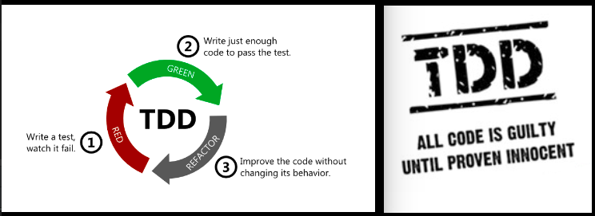

<div align="center">
<br>



</div>


<p align="center">


</p>


<h1 align="center"> Python - Test-driven development </h1>


<h3 align="center">
<a href="https://github.com/RazikaBengana/holbertonschool-higher_level_programming/tree/main/python-test_driven_development#eye-about">About</a> •
<a href="https://github.com/RazikaBengana/holbertonschool-higher_level_programming/tree/main/python-test_driven_development#hammer_and_wrench-tasks">Tasks</a> •
<a href="https://github.com/RazikaBengana/holbertonschool-higher_level_programming/tree/main/python-test_driven_development#memo-learning-objectives">Learning Objectives</a> •
<a href="https://github.com/RazikaBengana/holbertonschool-higher_level_programming/tree/main/python-test_driven_development#computer-requirements">Requirements</a> •
<a href="https://github.com/RazikaBengana/holbertonschool-higher_level_programming/tree/main/python-test_driven_development#mag_right-resources">Resources</a> •
<a href="https://github.com/RazikaBengana/holbertonschool-higher_level_programming/tree/main/python-test_driven_development#bust_in_silhouette-authors">Authors</a> •
<a href="https://github.com/RazikaBengana/holbertonschool-higher_level_programming/tree/main/python-test_driven_development#octocat-license">License</a>
</h3>

---

<!-- ------------------------------------------------------------------------------------------------- -->

<br>
<br>

## :eye: About

<br>

<div align="center">

**`Python - test-driven development`** theme focuses on writing tests before implementing the actual code to ensure proper functionality and error handling.
<br>
The programs showcase various functions like integer addition, matrix operations, text formatting, and name printing, each paired with comprehensive test cases that cover both normal usage and edge cases, demonstrating the practical application of test-driven development principles in Python.
<br>
<br>
This project has been created by **[Holberton School](https://www.holbertonschool.com/about-holberton)** to enable every student to understand how `TDD` in Python language works.

</div>

<br>
<br>

### Background Context

<br>

#### :warning: _Important notice on intranet checks for Python projects_

<br>

- **Starting from today**: <br> <br>

  - Based on the requirements of each task, **you should always write the documentation (module(s) + function(s)) and tests first**, before you actually code anything

  - The intranet checks for Python projects won’t be released before their first deadline, in order for you to focus more on `TDD` and think about all possible cases

  - We strongly encourage you to work together on test cases, so that you don’t miss any edge case. **But not in the implementation of them!**

  - **Don’t trust the user**, always think about all possible edge cases

<br>
<br>

<!-- ------------------------------------------------------------------------------------------------- -->

## :hammer_and_wrench: Tasks

<br>

**`0. Integers addition`**

**`1. Divide a matrix`**

**`2. Say my name`**

**`3. Print square`**

**`4. Text indentation`**

**`5. Max integer - Unittest`**

**`6. Matrix multiplication`**

**`7. Lazy matrix multiplication`**

<br>
<br>

<!-- ------------------------------------------------------------------------------------------------- -->

## :memo: Learning objectives

<br>

**_You are expected to be able to [explain to anyone](https://fs.blog/feynman-learning-technique/), without the help of Google:_**

<br>

```diff

General

+ Why Python programming is awesome

+ What’s an interactive test

+ Why tests are important

+ How to write Docstrings to create tests

+ How to write documentation for each module and function

+ What are the basic option flags to create tests

+ How to find edge cases

```

<br>
<br>

<!-- ------------------------------------------------------------------------------------------------- -->

## :computer: Requirements

<br>

```diff

Python Scripts

+ Allowed editors: vi, vim, emacs

+ All your files will be interpreted/compiled on Ubuntu 20.04 LTS using python3 (version 3.8.5)

+ All your files should end with a new line

+ The first line of all your files should be exactly #!/usr/bin/python3

+ A README.md file, at the root of the folder of the project, is mandatory

+ Your code should use the pycodestyle (version 2.7.*)

+ All your files must be executable

+ The length of your files will be tested using wc


Python Test Cases

+ Allowed editors: vi, vim, emacs

+ All your files should end with a new line

+ All your test files should be inside a folder tests

+ All your test files should be text files (extension: .txt)

+ All your tests should be executed by using this command: python3 -m doctest ./tests/*

+ All your modules should have a documentation (python3 -c 'print(__import__("my_module").__doc__)')

+ All your functions should have a documentation (python3 -c 'print(__import__("my_module").my_function.__doc__)')

+ A documentation is not a simple word, it’s a real sentence explaining what’s the purpose of the module, class or method (the length of it will be verified)

+ We strongly encourage you to work together on test cases, so that you don’t miss any edge case – The Checker is checking for tests!

```

<br>

**_Why all your files should end with a new line? See [HERE](https://unix.stackexchange.com/questions/18743/whats-the-point-in-adding-a-new-line-to-the-end-of-a-file/18789)_**

<br>
<br>

<!-- ------------------------------------------------------------------------------------------------- -->

## :mag_right: Resources

<br>

**_Do you need some help?_**

<br>

**Read or watch:**

* [doctest — Test interactive Python examples](https://docs.python.org/3.4/library/doctest.html)

* [doctest – Testing through documentation](https://pymotw.com/3/doctest/)

* [Unit Tests in Python](https://www.youtube.com/watch?v=1Lfv5tUGsn8)

<br>
<br>

<!-- ------------------------------------------------------------------------------------------------- -->

## :bust_in_silhouette: Authors

<br>

**${\color{blue}Razika \space Bengana}$**

<br>
<br>

<!-- ------------------------------------------------------------------------------------------------- -->

## :octocat: License

<br>

```Python - test-driven development``` _project has no license specified._

<br>
<br>

---

<p align="center"><br>2022</p>